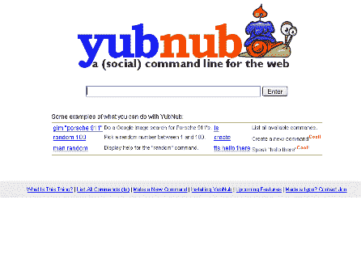

# YubNub 简介 

> 原文：<https://web.archive.org/web/http://www.techcrunch.com:80/2005/06/13/internet-command-line-yubnub/>

**公司:** [YubNub](https://web.archive.org/web/20201109031452/http://yubnub.org/)

 **什么事？**

乍一看，这看起来有点像搜索引擎什么的，但它不是。比那要干净得多。YubNub 是一个“网络命令行”,是用 Ruby on Rails 构建的。这意味着你可以通过 YubNub 网站上的命令框访问网络应用程序(比如谷歌、亚马逊和其他任何东西)。一个命令至少由两条信息组成——一个应用程序标识符和一个特定的命令。

例如，如果你输入“flkall ireland”，YubNub 会把你重定向到 flickr 网站，显示带有“ireland”标签的图片。

有大量的命令可用，用户可以直接创建新的命令。

你也可以用 YubHub 作为 [Firefox 扩展和其他方式](https://web.archive.org/web/20201109031452/http://yubnub.org/documentation/describe_installation)。
 **最喜欢的命令:**

flkall–显示输入了所有标签的 flickr 照片
GMT–查找输入位置的当地时间和日期
mini–使用 minilink.org
pod 将长 URL 转换为短 URL–在播客巷搜索播客。
报价–获取股票报价，只需输入符号
say–对“say”后输入的所有内容进行“say”[示例](https://web.archive.org/web/20201109031452/http://yubnub.org/example/tts?args=TechCrunch+is+the+most+awesome+of+everything+awesome+on+the+web+there+is+nothing+better+than+techcrunch)
“TTS”的别名
area code–根据区号查找城市。仅限我们。感谢威瑞森。
工作–在 Indeed.com 搜索包含所提供关键字的工作。
点击[查看当前所有命令列表](https://web.archive.org/web/20201109031452/http://yubnub.org/kernel/ls?args=)

**屏幕截图:**

 **方正:**

乔纳森·阿基诺

**相关链接:**

[乔纳森·阿基诺的博客](https://web.archive.org/web/20201109031452/http://jonaquino.blogspot.com/)
[传染上贪婪](https://web.archive.org/web/20201109031452/http://paul.kedrosky.com/archives/001449.html)
[巴特尔](https://web.archive.org/web/20201109031452/http://battellemedia.com/archives/001634.php)