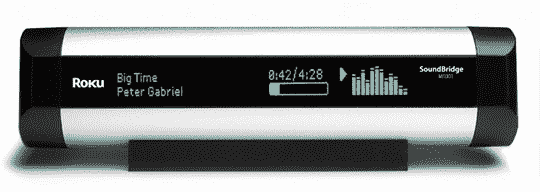

# 网络电台:热不热？

> 原文：<https://web.archive.org/web/http://techcrunch.com:80/2007/08/09/internet-radio-hot-or-not/>

波格先生今天的另一篇技术综述。今天的节目着眼于独立的网络收音机设备，这些设备接入你的家庭网络，让你听网络收音机、播客、MP3 等。而不必像珍珠果酱视频 (3 分 01 秒)中的那个家伙一样被束缚在你的电脑上。从综述中最大的收获是这些设备还没有达到黄金时段。受笨重的界面、最小的便携性和普遍缺乏吸引力的美学的困扰(“重点显然是工程而不是设计或用户友好”)，这些早期的鸟应该只被技术爱好者关注。

换句话说，是我们。

Pogue 研究了几种网络电台模型，包括 Phoenix、Pico、Noxon 和 SoundBridge 网络电台。其中，SoundBridge 似乎是你最好的选择。它有真正的立体声扬声器(其他大多数只支持单声道——蹩脚，但有多少互联网电台开始高保真广播？)并与 MAC 和 PC 都相处融洽。AM/FM 收音机支持，iTunes 播放列表支持和实际上有意义的按钮——一个源按钮！—所有这些都有助于将这台收音机放在其他收音机的前面。

互联网广播变得更容易了