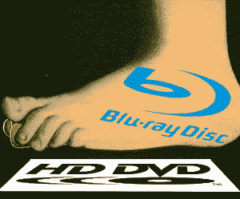

# HD DVD 于 2007 年秋天去世

> 原文：<https://web.archive.org/web/http://techcrunch.com/2007/06/27/interview-with-ken-lowe-vp-of-business-development-and-strategic-marketing-for-sigma-designs-talks-about-blu-ray-and-why-hd-dvd-is-dead/>

我和 [Sigma Designs](https://web.archive.org/web/20141003031334/http://www.sigmadesigns.com/public/index.html) 的[肯·劳](https://web.archive.org/web/20141003031334/http://www.sigmadesigns.com/public/Company/management_team.html)进行了一次有趣且内容丰富的谈话，他对下一代 DVD 格式战争的看法让我震惊。但是首先，关于 Sigma 设计和为什么这个人的观点对那些持观望态度的人很重要。Sigma Designs 的媒体处理器支持这两种标准，目前为市场上九款蓝光播放器中的六款提供支持，包括夏普、索尼、松下和先锋。他没有偏心，只是实话实说。

也许我对整个格式之争有些天真，但我没想到[在相当长的一段时间内会结束](https://web.archive.org/web/20141003031334/http://crunchgear.com/2007/06/25/no-end-in-sight-for-dvd-format-war/)。我会承认并说我错了。肯把它看做一盘棋。蓝光正在一个接一个地吃掉 HD DVD 的车，它们的国王即将“交配”。肯说，如果 HD DVD 能够在接下来的 60 到 90 天内取得重大进展，那么他们可能会自救，但假期将决定谁是赢家。降低 HD DVD 球员的价格并不能解决问题。他还告诉我们，个人电脑市场正在发挥比最初预期更大的作用。在我们的 PC/Mac 中，我们一直渴望的是什么？更大的空间，对吗？蓝光在单层上提供 25GB，在双层上提供 50GB，而 HD DVD 只能分别提供 15GB 和 30GB。

HD DVD 死了，各位。蓝光是明确的冠军，你最好振作起来，否则你会浪费你的钱。但是如果你和我一样，那么你在相当长的一段时间内都不会购买下一代 DVD。我们要不要坐在门廊上喝一杯冷饮，看看这场战斗会如何以及何时结束？