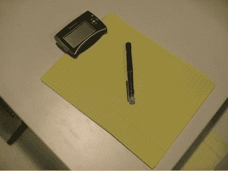

# IOGear Digital Scribe 让您轻松书写| TechCrunch

> 原文：<https://web.archive.org/web/http://techcrunch.com:80/2007/01/10/iogear-digital-scribe-lets-you-write-with-ease/>

IOGear 为那些仍然认为笔比剑笔记本电脑更强大的人提供了一款非常棒的产品。这种设备可以夹在笔记本上，一种带有传感器的特殊笔可以用来确定你何时书写。然后，你写下的任何东西都会出现在屏幕上，并可以变成文本或图像。在今年的 Q1，你可以以 59.99 美元的价格买到有线版本，无线版本的价格稍高一些。