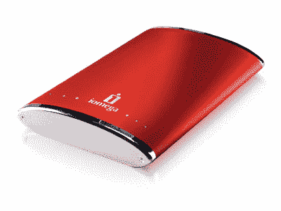

# Iomega 推出新的便携式外部驱动器

> 原文：<https://web.archive.org/web/http://techcrunch.com/2007/06/26/iomega-introduces-new-portable-external-drives/>

无论如何，外置硬盘都不是便携式的。随身携带 USB 线、驱动器和交流适配器一点也不好玩。Iomega 希望通过其新的 eGo 便携式硬盘来结束这种情况。凭借 160GB 的存储空间，这款产品通过 USB 2.0 连接供电，因此您不必携带笨重的电源线。凭借漂亮的鲜红色喷漆和时髦的设计，我不介意花 160 美元买一辆。

同时公布的还有 eSATA/USB 2.0 Pro 硬盘。它是专业的，因为，啊，它有一个 USB 2.0 连接和一个非常快的传输速率？它的存储容量为 500GB，零售价仅为 210 美元，所以还是很划算的。看起来 Iomega 又开始了它的游戏。无论如何，远离 Zip 和 Jaz 磁盘可能是个好主意。

[Iomega 推出便携式外置硬盘](https://web.archive.org/web/20161105092228/http://www.macnn.com/articles/07/06/26/iomega.external.drives/)