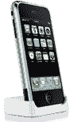

# iPhone 配件远没有 iPhone 本身那么令人兴奋

> 原文：<https://web.archive.org/web/http://techcrunch.com:80/2007/06/29/iphone-accessories-arent-nearly-as-exciting-as-the-iphone-proper/>

# iPhone 配件远没有 iPhone 本身那么令人兴奋

就在 iPhone 发布前几分钟，苹果揭开了一些 iPhone 配件的面纱。它们正是你所期望的:蓝牙耳机、dock 和 dock 适配器、TTY 适配器、立体声耳机等。还有一个 USB 电源适配器，据威瑞森称，你需要尽快购买。

苹果还首次推出了“与 iPhone 兼容”的标签。就像类似的 iPod 标签一样，你需要看到这个标志，我敢肯定苹果为此收取了很高的版税，以确保你购买的配件可以与 iPhone 兼容。

[iPhone 配件](https://web.archive.org/web/20130628204222/http://www.apple.com/iphone/accessories/)【苹果】