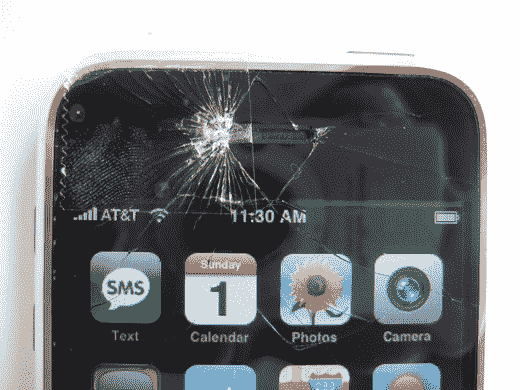

# iPhone 激活综述| TechCrunch

> 原文：<https://web.archive.org/web/http://techcrunch.com:80/2007/07/04/iphone-activation-round-up/>

所以你买了那个漂亮的小玻璃矩形，却没有意识到它需要被激活才能访问任何功能，现在你不想每月只为 iPod 和 WiFi 花费 60 美元。你很幸运，因为一些聪明人已经发明了一些方法，让你享受你的“有史以来最好的 iPod ”,而不用把你的灵魂卖给 AT&T。

以下是如何黑掉 iPhone，而不用比你已经拥有的多付一分钱。

*所有这些方法都来自 iPhone dev Wiki。目前，他们有一些服务器问题，并要求不要链接到。CrunchGear 对你的 iPhone 的任何损坏都不负任何责任。* 
**AT & T 漏洞**

1.成为美国电话电报公司的客户

2.将您的手机/计划升级到 iPhone 并正常激活

3.退还您的 iPhone 并切换回您的计划和手机(至少 14 天免费)。

4.告诉他们您想要保留 iPhone，以便您可以将其分配给新帐户。

5.取出设备顶部的 SIM 卡，享受。

**使用另一部 iPhone 激活一部 iPhone**

1.获得 2 部 iPhones

2.插入第一部 iPhone，在 iTunes 中选择“我是美国电话电报公司无线的新客户”，然后“激活个人或家庭通话计划中的 2 部或更多手机”

3.按照 FamilyTalk 计划的步骤，输入[手机号码]从另一个提供商(如 Sprint)转移号码

4.当您收到“激活完成”电子邮件时，请插入 2 号 iPhone。

5.选择选项“我是现有的美国电话电报公司(Cingular)无线客户”和“用这部 iPhone 替换我帐户上的手机”

6.使用[手机号码]再次填写信息。允许使用此号码激活 iPhone #2。这个号码是合法的。

7.插入 iPhone #1，它将解锁手机使用，但没有手机号码分配或来自 AT&T 的帐户。

**激活预付费计划** *(您必须为此付费，但不是按月付费)*

1.买 iPhone。

2.将它连接到 iTunes。

3.使用 999-99-9999 作为您的社会安全号码注册。

4.信用检查失败后，选择一个 GoPhone 计划。

5.注册 GoPhone 计划并获得号码和密码后，根据提示连接到美国电话电报公司 GoPhone 资金页面，输入您的信用卡或借记卡信息，您就可以开始了。**不要**试图通过电话向 AT & T 为你的 iPhone 充值。**不要**提前在 AT & T 设置你的 iPhone 预付费账户

或者直接下载乔恩的 DVD，iPhone 激活压缩文件，伪装成苹果的激活服务。很简单。