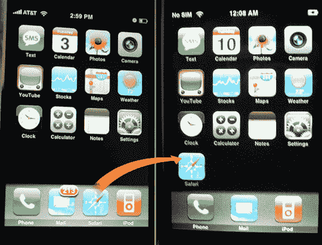

# iPhone 文件系统被黑

> 原文：<https://web.archive.org/web/http://techcrunch.com/2007/07/11/iphone-file-system-hacked/>

嗯，这是必然的。热爱 IRC 的 haxors 们发现了一种浏览 iPhone 文件系统的方法，他们知道如何取消激活要求。结果是一个惊人的变戏法:他们基本上把 Safari 图标移到了主图标集中。没什么大不了的，但足够令人印象深刻了。目前还不知道他们是如何做到的——一个工具很快就会推出——但看起来我们很快就能装上定制铃声，我们敢说，还有应用程序。

[iPhone 文件系统被黑，定制铃声即将到来](https://web.archive.org/web/20150907140005/http://gizmodo.com/gadgets/another-one-bites-the-dust/iphone-file-system-hacked-custom-ringtones-to-come-soon-276723.php)