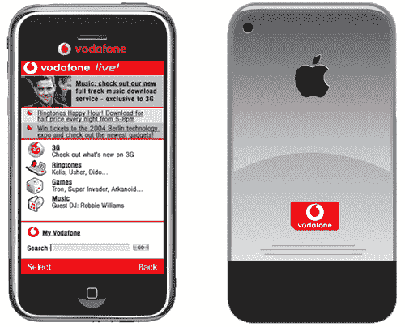

# iPhone 被黑进沃达丰网络工作？

> 原文：<https://web.archive.org/web/http://techcrunch.com/2007/07/19/iphone-hacked-to-work-on-vodafone-network/>

一些非常奇怪和奇妙的事情正在非官方的苹果博客上发生。显然，他们的一个读者已经设法让 iPhone 在欧洲的沃达丰网络上工作。

通过使用一个名为[I assign](https://web.archive.org/web/20141217042517/http://crunchgear.com/2007/07/18/iphone-partially-unlocked/)的应用程序和一张预付费 AT & T 卡，他能够让沃达丰更改合同，通过引入一张内置预付费 sim 卡的旧 o2XDA 来识别与 AT & T sim 卡绑定的特殊代码(称为 USIM 号码)。然后当他回到家，他把卡从 o2 手机中取出，放入 iPhone，shazaam，它工作了。差不多吧。

这在#iphone IRC 频道引发了相当数量的网络书呆子愤怒，因为它不应该工作。这位读者声称，除了可视语音邮件之外，它确实有效。

这篇文章已经更新了几次，所以随着这个故事的进一步发展，可能会有更多的信息流出。

[据报道，英国 iPhone 可以与沃达丰一起使用【tuaw.com ](https://web.archive.org/web/20141217042517/http://www.tuaw.com/2007/07/19/uk-iphone-reportedly-functioning-with-vodafone/)