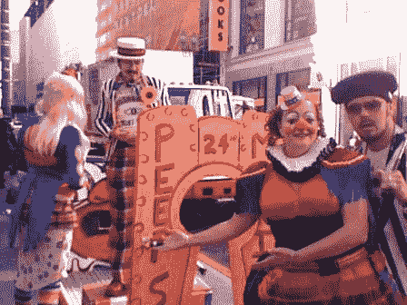

# iPhone 疯狂袭击旧金山:小丑！TechCrunch

> 原文：<https://web.archive.org/web/http://techcrunch.com:80/2007/06/29/iphone-madness-hits-san-francisco-clowns/>

# iPhone 疯狂袭击旧金山:小丑！

这就是了。今天是每个天使获得翅膀的日子。我们中的一些人会报道纽约的疯狂，尽管如此，但我们不要忘记其他一些被 2007 年苹果节吸引的城市。例如，在被称为旧金山的伟大的自由主义快客巢穴中，一个“喜剧马戏团”(ugh)建立了一个迷你高尔夫球场，我们也收到了关于一个穿着西装的男人的报告，可能不止一个。最后一次检查时，他随身带了一台 MacBook Pro。

也有关于小丑散播 iPhone 宣传的报道。他一定是个小工具博主。

[苹果商店旧金山 iPhone 线已经是一个三环马戏团](https://web.archive.org/web/20130628200857/http://www.appleinsider.com/articles/07/06/28/apple_store_san_fran_iphone_line_already_a_three_ring_circus.html)