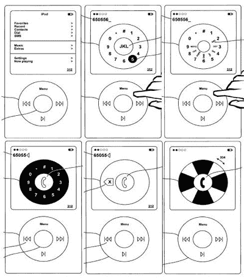

# iPhone Nano 应该是真的，只是它没有触摸屏。当然… 

> 原文：<https://web.archive.org/web/http://techcrunch.com/2007/07/26/iphone-nano-supposedly-real-only-it-doesnt-have-touch-screen-sure/>

显然，鲍勃·伍德沃德现在是一名电子产品博主。不明智的观点*坚持*iPhone nano 是真的。它还坚持说 iPhone nano 不会——重复一遍，不会——有触摸屏。超级棒。苹果为什么要移除 iPhone 唯一的杀手级应用？这并不是因为 AT & T 拥有如此出色的蜂窝网络，人们才会蜂拥购买 iPhone。(或者也许在纽约不仅仅是臭烘烘的？)不管怎样，观点认为，当 JP 摩根说它不能确认 iPhone nano 的可用性时，这并不是收回其早先的说法，“当然，iPhone nano 有一天可能会出来。”太棒了。

我想我只是不“相信”苹果会发布一款没有其大肆吹嘘的触摸屏的 iPhone。那就好比发布了 Xbox 360 却没有玩视频游戏的能力；您只能将您的照片和视频流式传输到它。依我看，这似乎很傻。

[iPhone Nano 是真的](https://web.archive.org/web/20141117182810/http://www.unwiredview.com/2007/07/25/iphone-nano-is-real/)【无线查看】