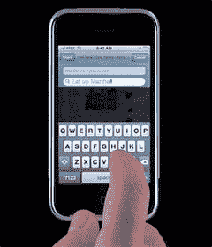

# iPhone 部分解锁| TechCrunch

> 原文：<https://web.archive.org/web/http://techcrunch.com/2007/07/18/iphone-partially-unlocked/>

Gizmodo 报道说 iPhone Dev Wiki 的黑客已经成功解锁了 iPhone…部分解锁。你现在还不能使用 T-Mobile 帐户，但你可以使用你选择的任何美国电话电报公司 SIM 卡。这意味着任何预付费、Cingular 或美国电话电报公司 SIM 卡都可以放入 iPhone 中，并可以拨打电话。有了 iPhone 自带的无线网络，你就可以随心所欲了。

黑客是通过使用一个名为 iASign 的应用程序和 iPhone 的无线电芯片组完成的。这很复杂，所以点击跳转查看完整的解释。

> 解锁的所有问题都出在基带，iPhone 的无线电芯片组。芯片组是 S-Gold2，不要在聊天中给我们 PapaUtils 的链接，我们不能使用它们。现在 iPhone 只有一个锁，网络个性化锁。这个锁意味着 MCC(美国=310)和 MNC(美国电话电报公司=410)必须与 IMSI SIM 卡的前六位数字相匹配。这种检查是在基带固件本身中完成的。我还不确定在哪里，但这并不重要。唯一阻碍解锁的是基带。所有其他 sim 卡检查都是已知的，可以修补。我们甚至知道执行解锁的 AT 命令。是' AT+CLCK="PN "，0，" xxxxxxxx " '。但是祝你好运找到那些 x。他们被称为 NCK，或网络控制键，并被认为是每个人的手机唯一的。忘记蛮力(时间不切实际)和显而易见的条目。如果你仍然认为暴力是一个好主意，读读这个。此外，每部手机有 3-10 次解锁尝试的限制，在此之后，固件会将自己“硬锁定”到 AT&T。那么我们为什么不能只修补固件呢？位于 ramdisk/usr/local/standalone/firmware/ice 03 . 12 . 06 _ g . FLS 中的固件已签名。请在这里查看关于该文件的已知信息。在基带引导加载程序中检查 sig。更新程序 bbupdater 只检查校验和，这是可以改变的。更新将采取，但然后手机不会启动，因为签名不匹配。
> 我们花了整整两天的时间拆卸无线电 fw。有几个后门，但没有一个能打开。如果你对拆卸臂很在行，PM geohot 为 idb。我们已经很好地记录了许多函数。虽然，这个固件很难通过工作。我 90%确定密码检查发生在名为 pwdcheck 的函数中，但我还没找到。据我们所知，可能有一个简单的算法来生成我们错过的 nck。

有道理吗？是啊，对我来说也没什么意义。但如果 iPhone 解锁了，我可能会考虑买一部。你会吗？

[iPhone 部分解锁，通话没有 AT & T 合约](https://web.archive.org/web/20170707230943/http://gizmodo.com/gadgets/breaking/iphone-partially-unlocked-calls-without-att-contract-279606.php) [Gizmodo]