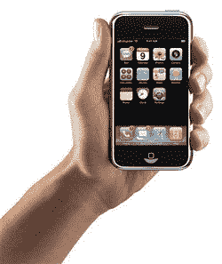

# iPhone 对消费者来说太奢侈了

> 原文：<https://web.archive.org/web/http://techcrunch.com:80/2007/02/23/iphone-too-spensive-for-consumers/>

看起来，随着 iPhone 的发布，苹果的销量可能会有所下降。根据最近对 379 人的调查，iPhone 的价格对大多数人的口味来说太贵了。事实上，只有 1%的受访者说他们会花 500 美元买一部 iPhone。42%的人说他们会支付 200 到 299 美元，而 60%的人说他们会更换运营商来得到它。

如果 iPhone 要取得成功，Cingular 必须给人们一个两年合约的好交易。或许 399 美元的低价合同版可以解决这个问题？我的意思是，人们在发布会上花高价购买新的黑莓手机。只有时间能告诉我们 iPhone 会发生什么。

[研究:消费者不愿意为 iPhone 支付 500 美元](https://web.archive.org/web/20160420190350/http://news.yahoo.com/s/infoworld/20070223/tc_infoworld/86300;_ylt=AnEO9FyhXILJl5ROkuiNGiv67rEF)【雅虎！]