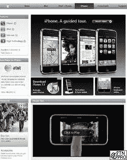

# iPhone.com 最终被苹果 TechCrunch 收购

> 原文：<https://web.archive.org/web/http://techcrunch.com/2007/07/03/iphonecom-finally-acquired-by-apple/>

# iPhone.com 最终被苹果公司收购

6 月 29 日到了，我心想，“苹果肯定是从域名所有者手中购买了 iphone.com。”令我惊讶的是，我发现 iphone.com 只是一个非常劣质的“Web 1.0”页面，上面有各种解锁手机的链接——某种原始的商业幌子。我以为苹果会满足于不拥有 iphone.com，但是我错了。

似乎 iphone.com 是由一个叫迈克尔·科瓦奇的人拥有和经营的。迈克早在 1995 年就买下了域名，试图开始一项新的业务。为了不成为苹果的眼中钉，他把域名卖给了苹果，价格未透露，据传价值超过 100 万美元。不过，Mike 对尽早挑选好域名并不陌生。他目前拥有大型搜索引擎优化公司，如 Wine.net、Golf.net 和 Teeshirt.com。不算太寒酸。到下周，iphone.com 的移交将全部完成。

[IPhone.com 被苹果公司收购](https://web.archive.org/web/20220928065033/http://blog.domaintools.com/2007/07/iphone-now-owned-by-apple/)