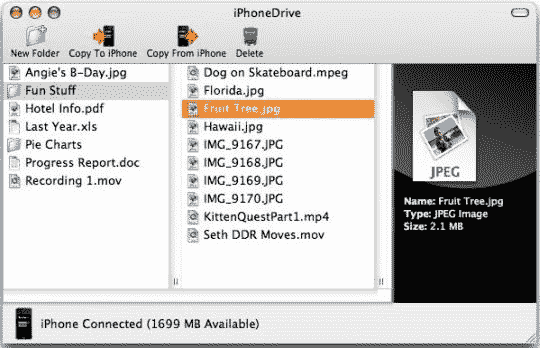

# iPhoneDrive 更新，iPhone 现在更有驱动力| TechCrunch

> 原文：<https://web.archive.org/web/http://techcrunch.com/2007/07/20/iphonedrive-updated-iphone-now-more-drive-y/>

[Ecamm Network](https://web.archive.org/web/20140314004010/http://www.ecamm.com/) 已经更新了它的 [iPhoneDrive](https://web.archive.org/web/20140314004010/http://crunchgear.com/2007/07/11/iphonedrive-makes-iphone-a-hard-drive/) 软件(允许你在手机和电脑之间拖放文件),以支持在你的 iPhone 上移动文件，就像它是一个真正的便携式驱动器一样。

你还可以从手机上拖拽多个文件，iTunes 的一个 bug 也已经修复。

该软件售价 9.95 美元，直到苹果公司决定启用这一功能，就像它一开始就应该做的那样。

[iPhoneDrive](https://web.archive.org/web/20140314004010/http://crunchgear.com/2007/07/11/iphonedrive-makes-iphone-a-hard-drive/) 通过 [Macenstein](https://web.archive.org/web/20140314004010/http://macenstein.com/default/archives/723)