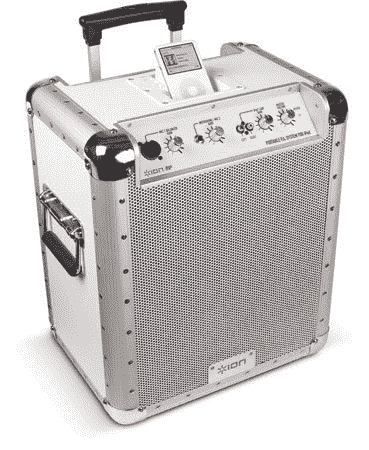

# IPod Dock 无视噪音条例| TechCrunch

> 原文：<https://web.archive.org/web/http://techcrunch.com/2007/02/18/ipod-dock-defies-noise-ordinances/>

有了 Ion Audio 的 [iPA03](https://web.archive.org/web/20150514181439/http://www.ion-audio.com/ipa03.php) ，你将成为所有执法官员羡慕的对象，他们会因为噪音投诉而回应你的后院聚会。便携式扬声器系统配有 iPod 基座、麦克风、CD/MP3 和乐器输入。重型铝制系统包括一个内置的可充电电池，可持续超过 6 个小时，并提供超过 150 英尺的高保真声音。

[iPA03](https://web.archive.org/web/20150514181439/http://www.ion-audio.com/ipa03.php) [ [红貂日报](https://web.archive.org/web/20150514181439/http://www.redferret.net/?p=8310)经由 [Slashgear](https://web.archive.org/web/20150514181439/http://www.slashgear.com/pa-for-ipod-gets-your-tunes-heard-173956.php)