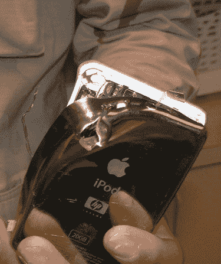

# iPod 在伊拉克救了一个士兵的命？TechCrunch

> 原文：<https://web.archive.org/web/http://techcrunch.com:80/2007/04/06/ipod-saves-a-soldiers-life-in-iraq/>

# iPod 在伊拉克救了一个士兵的命？

一个 iPod 在伊拉克救了一个士兵的命，至少故事是这样的。一张被毁坏的 iPod 的照片出现在 Flickr 上，并附有一条信息说它是在一名美国士兵和一些伊拉克歹徒的交火中被毁坏的。据推测，一颗 AK-47 的子弹穿过了士兵方便的时髦 iPod 夹克口袋，苹果的小型便携式媒体播放器阻止了子弹穿过。(还好不是 nano。)有消息称，苹果发现了这名士兵的苦难经历，想要免费更换 iPod。苹果真好。

[Ipod 拯救士兵生命](https://web.archive.org/web/20130628160247/http://www.flickr.com/photos/tiki/445618364/in/pool-appleusers/)【Flickr via[iLounge](https://web.archive.org/web/20130628160247/http://ilounge.com/index.php/news/comments/ipod-saves-soldiers-life-in-iraq/)