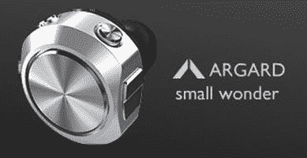

# iPod Shuffle 赢得 2007 年设计周大奖

> 原文：<https://web.archive.org/web/http://techcrunch.com/2007/02/23/ipod-shuffle-wins-a-2007-design-week-award/>

苹果第二代 iPod Shuffle 获得了令人难以置信的好评。这个设计真的很棒，甚至让我在刚刚过去的光明节为我的朋友买了一个。现在，苹果的 iPod Shuffle 得到了一些当之无愧的认可。在 2007 年英国设计周颁奖典礼上，乔布斯和他的公司获得了最佳消费产品设计的最高荣誉奖。康兰合伙公司的塞巴斯蒂安·康兰对这一决定有如下看法:

> 虽然有各种各样有趣的产品，但也有大量来自苹果设计团队的作品，虽然都很优秀，但只有 Shuffle 是真正的“新”对所有其他参赛作品来说，感觉有点不公平，尽管它们基本上都非常好，但苹果——凭借其对创新和进化设计的不懈承诺以及对细节的关注——应该再次赢得杆位。Shuffle 是一个简单、完美的概念，采用最小、可重复使用的包装，物超所值。"

我完全同意。恭喜苹果。

[苹果 2G iPod shuffle 荣获设计大奖](https://web.archive.org/web/20151001135454/http://ilounge.com/index.php/news/comments/apple-2g-ipod-shuffle-wins-design-award/)【iLounge】
[完整详情(PDF)](https://web.archive.org/web/20151001135454/http://www.designweekawards.co.uk/Assets/Files/17.%20Consumer%20Product%20Design.pdf)