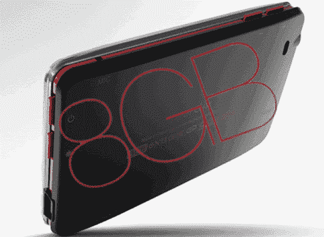

# iRiver Clix 2 升级至 8GB | TechCrunch

> 原文：<https://web.archive.org/web/http://techcrunch.com/2007/07/10/iriver-clix-2-gets-bumped-to-8gb/>

iRiver Clix 系列基于 flash 的数字音频播放器的粉丝将会很高兴听到他们计划在今年 8 月推出 8GB 型号。

增强版将与第二代 Clix 相同，除了播放器周围的红色装饰和两倍的存储容量。

Clix 2 采用 2.2 英寸 AMOLED 显示屏，电池续航时间可用于 24 小时的音频或 5 小时的视频，FM 调谐器和录音机，Flash 游戏，可以播放 MP3，WMA(订阅或其他)，OGG，WMV9 和 MPEG4 格式。

4GB 版本现在售价不到 200 美元。8GB 型号的定价还没有消息，预计在 8 月份发布。

[iRiver Clix 升级到 8GB](https://web.archive.org/web/20140917152922/http://www.ubergizmo.com/15/archives/2007/07/iriver_clix_gets_bumped_to_8gb.html)