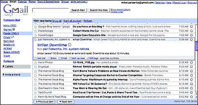
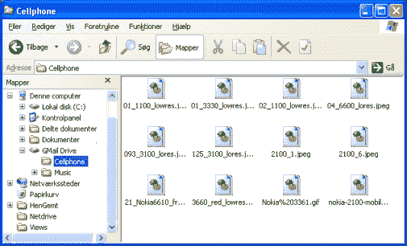

# 是与微软说再见，还是就此作别？

> 原文：<https://web.archive.org/web/http://techcrunch.com:80/2006/11/01/is-it-bye-bye-microsoft-or-just-au-revoir/>

由于 TechCrunch(英国)的性质，我总是安装和卸载测试版软件，因此我的媒体中心电脑崩溃只是时间问题。幸运的是，我只丢失了几天没有备份的工作。例如，我的 Outlook 2007 PST 存储区中的一些新电子邮件、日历条目和联系人。所以如果我没有给你回信或打电话，这可能就是原因。；-)

可悲的是，问题比我最初想的还要糟糕，Windows XP 的“系统恢复”功能已经损坏，这意味着我必须完全重新安装我的桌面操作系统以及所有的应用程序。起初，这让我非常焦虑；在接下来的几个小时里看着进度完成栏的想法并不是一个令人愉快的前景，但当我决定这是将我的整个数字生活(和数据)转移到网络的好时机时，我突然感到一股解放的浪潮向我袭来。

你可能在想，这太快了，他疯了，他的头一定在云里，你在所有方面都是对的！是的，我的脑袋在云里，但是谷歌和亚马逊的云。可能是不是太早了？但是我已经谈了足够多的 Web 2.0 话题(在会议上)，现在该是我实践的时候了。**我的目标是简单地将我的数据从应用程序中分离出来，进而从操作系统中分离出来**。

为了实现我的目标，我需要做的第一件事就是**消除我对特定操作系统桌面应用的依赖**。为了帮助我做到这一点，我选择使用最近推出的 [Google Apps for Your Domain](https://web.archive.org/web/20201204061020/http://googlesystem.blogspot.com/2006/08/google-launches-corporate-package.html) 来托管我的 POP3 电子邮件帐户和日历。这种转变非常有效。我“简单地”用这个谷歌教程[修改了我的 MX 域名记录和 CNAME 的详细信息，几个小时后，我的电子邮件和日历请求就很高兴地通过谷歌传来了。](https://web.archive.org/web/20201204061020/http://www.google.com/support/a/bin/answer.py?answer=33352)

感觉很大胆，下一个被移除的桌面项目是我的桌面 RSS 阅读器。在那之前，我愉快地使用了 Outlook 的 [Attensa](https://web.archive.org/web/20201204061020/http://www.attensa.com/) 和 IE7 的 [Windows RSS 平台](https://web.archive.org/web/20201204061020/http://blogs.msdn.com/ie/archive/2006/02/01/522481.aspx)的组合。相反，我决定把它们都换成最近发布的[谷歌阅读器](https://web.archive.org/web/20201204061020/http://www.google.com/reader)，它有“新闻之河”风格的界面，可以更容易地快速阅读我的最新信息。显然，在我将[转移到 **G-Reader** 的正面体验中，我并不孤单。](https://web.archive.org/web/20201204061020/http://scobleizer.com/2006/10/30/dave-winer-was-right-about-river-reading/)

我遇到的唯一问题是，目前 Gmail 客户端和 G-Reader 客户端没有集成，这意味着我不得不在 Firefox 中一直保持两个标签窗口打开，但在快速搜索后，我找到了一个[网站](https://web.archive.org/web/20201204061020/http://persistent.info/archives/2006/10/13/google-reader-redux)，它有一个 **greasemonkey** 脚本，使我能够在同一网页上看到两个阅读器。

下一个大挑战是看看我的桌面上是否可以没有微软的 Office。十多年来，微软 Office 一直是我电脑生活的主要支柱。尽管我认为自己是 Outlook 和 Powerpoint 的重度用户，但我现在认为自己是 Excel、Word 和 Access 的“轻度”用户。因此，我决定尝试一下谷歌文档。

我惊喜地发现，尽管它仍然非常初级——就像回到 Office 2002 或更早——该产品非常符合我的“精简”用户需求。也就是说， **Docs & Spreadsheet** 最大的好处是能够与其他人在线协作。通常情况下，这就是我这些天发现自己在做的事情。例如，在 TechCrunch 派对上，我和几个人一起讨论了与会者名单。我不再需要通过电子邮件发送文档附件，然后整合几个人的修改。我只是邀请人们使用在线文件，我们都在同一个文件上合作。当然，如果谷歌早点收购 [**JotSpot**](https://web.archive.org/web/20201204061020/http://googleblog.blogspot.com/2006/10/spot-on.html) ，我可能会额外使用维基功能。

使用 Docs & Spreadsheet 使我成功地从我的桌面上移除了对 Word、Excel 和 Access 2003 的需求，并且明确地说，我将**而不是**升级[到 Office 2007，只需 400 美元。相反，如果我将来需要阅读 Office 附件，我会使用 Office 2007 免费查看器，或者我可以等到谷歌为 Docs 电子表格提供免费的转换器/阅读器。事实上，我今天收到的大多数文件都是 PDF 文件附件，我已经用更小、更快、免费的 Firefox 插件 Foxit 取代了 Adobe 的桌面阅读器。](https://web.archive.org/web/20201204061020/http://www.microsoft.com/office/preview/info/pricing.mspx)

同样，在取代了对 Outlook 的需求之后，Outlook 和谷歌日历以及各自收件箱之间的同步问题很快成为了一个无关紧要的问题。不过，如果你仍然希望继续使用 Outlook 的日历，还有第三方解决方案可以让你将这两种服务联系起来。最后一个主要障碍是取代对 PowerPoint 的需求，所以我决定尝试在线服务的组合。我使用的第一个工具是[的 SlideShare](https://web.archive.org/web/20201204061020/http://www.beta.techcrunch.com/2006/10/04/introducing-slideshare-power-point-youtube/) ，它可以让我上传我现有的(旧的)Powerpoint 演示文稿，并在网上发布。其次，我正在尝试两个在线演示工具， [Empressr](https://web.archive.org/web/20201204061020/http://www.beta.techcrunch.com/2006/07/12/empressr-a-flash-powerpoint-competitor/) 和 [Thumbstacks](https://web.archive.org/web/20201204061020/http://www.beta.techcrunch.com/2006/03/09/thumbstacks-ajaxflash-web-powerpoint/) 。随着谷歌继续“在线”构建他们的 Office 版本，我猜用不了多久，谷歌[就会再次进入市场](https://web.archive.org/web/20201204061020/http://en.wikipedia.org/wiki/List_of_acquisitions_by_Google)并购买一个演示工具，但会是哪一个呢？

因此，到目前为止，我已经很高兴地不再需要 Windows XP (SP2)中的大多数桌面应用程序，但我希望有一个在线存储驱动器，这样我就可以真正摆脱操作系统，当我外出时，我也可以访问我的文件。有许多关于 Google Drive 或 G:Drive 的传言，甚至有人报道说“ **[Playtpus](https://web.archive.org/web/20201204061020/http://www.start.com.my/blog/google-playtpus-gdrive/)** ”是这项服务的代号。在我等待谷歌的同时，其他人也在忙着创建他们自己的与 GMail 协同工作的版本，比如 GSpace 或 Windows Explorer Gmail 的外壳扩展，这两个我都在使用。

更有趣的是，昨天有报道称谷歌已经悄悄地升级了 Gmail 账户，以提供 15 GB 的存储空间。“至少有[两个](https://web.archive.org/web/20201204061020/http://jerryr.com/2006/9/22/google-apps-gmail-now-holds-15-gb)T4 人注意到了，所以很难认为这是一个错误”。目前“你的领域的谷歌应用程序”中的 Gmail 帐户只提供 2 GB 的存储空间，但 15Gb 将使我能够把我所有的本地文件转移到谷歌。为了填补等待的空白，我还使用了亚马逊 S3 服务来进一步存储/备份我的数据。也就是说，我不会把所有的鸡蛋放在一个谷歌篮子里。

现在，我所有的数据都以非专有格式存储在网上——ODF、MP3、HTML、XML 等，或者在谷歌或者亚马逊云上，但更重要的是，我从桌面上解放了出来。也就是说，硬件和设备对我来说不太重要。
在本帖的**第二部分**中，我将解释我用什么软件服务取代了 Windows OneCare(注意你怎么说)+ Windows Defender 以及 Internet Explorer、Messenger 和 Windows Media Player。这比我最初想的要容易得多，而且我没有花一分钱就获得了更好的服务和/或功能。

在这篇文章的第三部分，我将解释我是如何摆脱对 Windows XP 的依赖的。现在我有了一台运行最新版本 Ubuntu(Linux 发行版)的双引导电脑，因为 Ubuntu 运行与我当前的 Windows XP 配置相同的 Firefox 浏览器、音乐播放器和应用软件，所以除了 Linux 操作系统的特定工具本身，我没有新的学习曲线。

这是第一次，这次崩溃和恢复练习终于让我能够正确地审视 Linux 操作系统和苹果(Mac) OS X 相对于 Windows XP 和 Vista 平台的优势和优点，但这只是因为我现在可以在所有这些主要操作系统上运行类似的、熟悉的应用程序，还因为我可以在线访问我所有的电子邮件、日历和文档。

当然，这种在线配置有一些功能限制，但目前大多数漏洞都被 greasemonkey 脚本或 Firefox 扩展填补了。

但我也考虑过使用微软的 Live 平台，但他们的桌面和网络搜索、小工具战略、托管服务和应用战略要么不清楚，要么不如谷歌。关于雅虎，他们有许多与谷歌类似的服务，有些当然比谷歌好很多，但是雅虎 Office 和 Y: Drive 在哪里？我猜在我考虑把我的数字生活/数据转移给他们之前，他们需要再次打开支票簿，并可能收购像 Zoho 或 T2 这样的公司。

当然[并不是每个人都同意](https://web.archive.org/web/20201204061020/http://dondodge.typepad.com/the_next_big_thing/2006/08/google_competes.html)这种向网络的迁移，我必须承认对许多人来说，桌面应用程序的丰富性仍将保持优势。我想我在寻找的是选择的灵活性，而不是我不再需要或负担不起的臃肿的功能。

**更新:**

当然总有第三种方式，Scrybe 是一个新的在线套件，有离线模式。查看令人印象深刻的演示视频。Scrybe 今天发布了他们的测试版。奇怪的是，当我写这篇文章并在网上移动我的数字生活时，有人也有同样的观点。他们的[帖子](https://web.archive.org/web/20201204061020/http://www.readwriteweb.com/archives/elephants_and_evolution.php)对这个问题的看法略有不同，但我觉得我们都同意，未来重要的是数据的自由和重要性，而不是操作系统或应用程序。