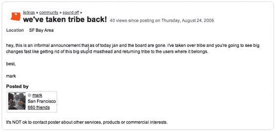

# 马克·平卡斯回到部落了吗？

> 原文：<https://web.archive.org/web/http://www.techcrunch.com:80/2006/08/24/is-mark-pincus-back-at-tribe>

# 马克·平卡斯回到部落了吗？

**更新:**这个现在已经确定了。马克·平卡斯回到部落了。

  这只是怪异。马克·平卡斯可能会回到部落。或者有人刚刚劫持了他的部落账户。

马克早在 4 月份就被从首席执行官的位置上赶了下来(马克·坎特首先发现了这一点，马特·马歇尔在这里有一个很好的总结)。新任首席执行官 Jan Gullet 接任，Pincus 当时评论道:“我真的不喜欢做日常的人员和项目经理……我认为这不是我特别擅长的事情。这是不是又一个创始人被推出去又踢又叫的案例？我从来不是这样的。”

但是今天 [Eran Globen](https://web.archive.org/web/20230217142740/http://hellonline.com/blog/?p=86) 在 Mark Pincus 的部落页面上发现了一个[列表，上面写着 Mark 回来了，Jan 走了，其他的变化正在发生:](https://web.archive.org/web/20230217142740/http://sanfrancisco.tribe.net/listing/weve-taken-tribe-back/san-francisco-ca/36bbc4a2-00b0-4ae9-a7dc-9a61ff3cd937)

这也是[这里的](https://web.archive.org/web/20230217142740/http://people.tribe.net/markpincus/blog/3cdf1a6d-c0d3-4d3a-b4d0-1f3d25055b6d)，称谓不同。

至少可以说，传达这一信息的语言和方法很奇怪。但这绝对是马克的部落页面。我把链接发邮件给马克，问他是否有什么评论。他回复说“一小时后可以”，但是两个小时后我还没有收到他的回复，我还收到了几封电子邮件。

所以我不知道这是怎么回事，但马克引起了我的注意。而且，很有可能是有人闯入了马克的部落账户并发布了这个。
