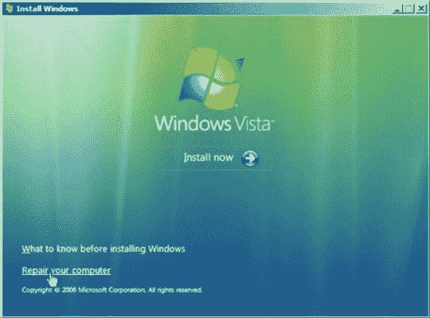

# Vista 坏了吗？乔·威尔科克斯说“是”

> 原文：<https://web.archive.org/web/http://techcrunch.com/2007/08/10/is-vista-broken-joe-wilcox-says-yes/>

乔·威尔科克斯不喜欢 Windows Vista。我能同情。我刚买了一台新电脑，在使用 XP 很多年后，我很兴奋地看到了 Vista 到底是怎么回事。

在每天无缘无故地与我的无线网络随机断开几次连接，并且无法快速诊断或修复我的连接(或安装任何东西)而不被安全警告轰炸之后，我渴望拥有我可信赖、可靠的 XP 装备。我最初的体验非常一般。Vista 很漂亮，这是肯定的。但它有问题，而且不稳定，就像(即将推出的总体概括)漂亮的人有问题，而且不稳定。

这并不是说我不能简单地关闭安全信息或花时间找出为什么我的无线网卡如此不可靠，这是事实的原则，Vista 应该比它的前身好得多。

在你开始用“别像个孩子一样”和“如果你这么讨厌它，为什么不换回它”的评论来痛斥我之前，花点时间读一读威尔科克斯的文章。他比我更生气。

他的论点是，Vista 的体验太差了，无法修复。我不确定。我似乎记得 Windows XP 在 SP2 发布之前有点令人沮丧。不过，我们离 SP2 远景很远。

[破窗](https://web.archive.org/web/20160422071152/http://www.microsoft-watch.com/content/vista/broken_windows.html)【微软观察】