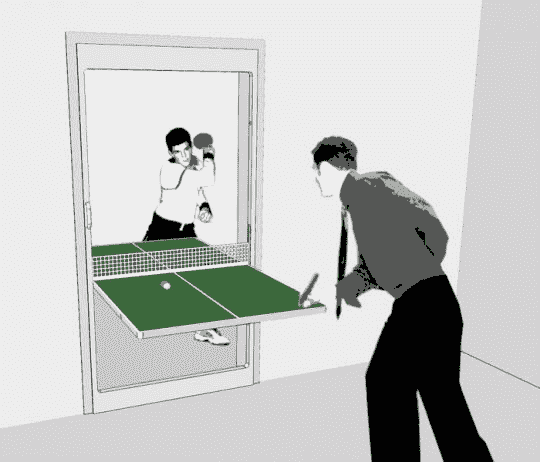

# 这是一扇门和一张乒乓球桌，看！？

> 原文：<https://web.archive.org/web/http://techcrunch.com:80/2007/05/08/its-a-door-and-a-ping-pong-table-see/>

啊，公寓的伙伴们。如果你像我一样，你的公寓，即使很宽敞，也可以使用更多的空间。我是说，当你为一间两居室的房子付钱时，你会把乒乓球桌放在哪里？你可以打 Wii 网球，但说真的，真正的乒乓球是必由之路。

如果你有门，你现在可以打乒乓球了。这张桌子——网和所有的——兼作门。它像任何标准的门一样打开，然后前后旋转，形成一个游戏面。这有点像墨菲床上的运动风格。

没有理由把它局限在乒乓球上。事实上，在未来，我们会看到空气曲棍球门，沙拉吧门，婴儿换衣站门，手术台门，甚至复活 Axl Rose 事业的门。好吧，最后一个是个笑话。

[乒乓门](https://web.archive.org/web/20150912090644/http://tekenstein.com/ping-pong-door)【泰肯斯坦】