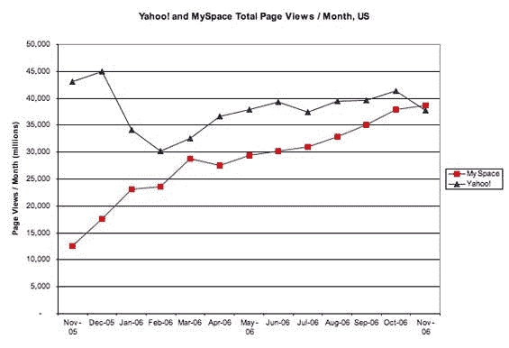
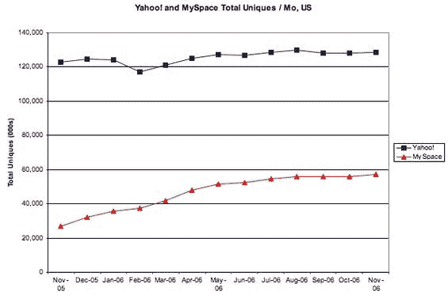

# 官方消息:MySpace 是互联网上最大的网站 TechCrunch

> 原文：<https://web.archive.org/web/http://www.techcrunch.com:80/2006/12/12/its-officialish-myspace-is-biggest-site-on-internet/>

# 官方消息:MySpace 是互联网上最大的网站

11 月的康姆斯克数据显示了不可避免的事实:福克斯互动(主要是 MySpace)现在的页面浏览量超过了雅虎网站的总和，第一次坐上了头把交椅。这与其说与 MySpace 的增长有关，不如说与雅虎总流量下降 9%有关(11 月所有网站的总流量仅下降 3%；谷歌上涨了 5%)。

然而，雅虎仍然在独立访问者总数上占据主导地位，访问雅虎网站的人数是 MySpace 的两倍多。最终的游戏不是页面浏览量，它的用户关注度，以及最终的收入。然而，MySpace 今天有充分的理由打开香槟，庆祝他们在过去 12 个月中页面浏览量 200%的增长。
 [当然，一两次快速收购](https://web.archive.org/web/20230203005615/http://techcrunch.com/2006/12/12/yahoos-project-fraternity-docs-leaked/)会让雅虎重回第一的位置。

