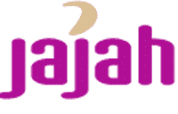

# JAJAH 从英特尔 TechCrunch 获得 2000 万美元的 C 轮融资

> 原文：<https://web.archive.org/web/http://www.techcrunch.com:80/2007/05/09/jajah-lands-20-million-series-c-funding-from-intel/>

# JAJAH 从英特尔获得 2000 万美元的 C 轮融资

 VOIP 提供商 [JAJAH](https://web.archive.org/web/20220926105304/http://www.jajah.com/) 今天完成了 2000 万美元的 C 轮融资，领投来自英特尔的风险投资部门[英特尔投资](https://web.archive.org/web/20220926105304/http://www.intel.com/capital/)。

之前的 TechCrunch 报道[点击这里](https://web.archive.org/web/20220926105304/http://www.beta.techcrunch.com/tag/jajah)。

作为交易的一部分，英特尔将向 JAJAH 提供产品经销商、OEM 客户和开发人员社区的访问权限，以及英特尔一系列 VOIP 专利的访问权限。

在今天的声明之前，我与 JAJAH 首席执行官 Trevor Healy 进行了交谈。尽管他无法说明 JAJAH 将会以何种方式为我利用英特尔的专利，但很明显，他们对这一进步感到满意。

除了额外的 2000 万美元存款外，希利还解释了新政的其他一些好处。接触英特尔内部人士使 JAJAH 能够针对英特尔芯片更好地优化他们的产品，包括当前和计划未来发布的产品。

这笔交易支持了 JAJAH 对移动技术的重视。从现有平台到融合了计算机、移动和 wifi 技术的超移动设备，JAJAH 希望成为首选 VOIP 提供商，而英特尔的交易应该有助于他们实现这一目标。

在 Skype 上，该公司试图避免苹果和苹果的比较。正如我们之前报道的那样，JAJAH 的 VOIP 服务是点对点的，通过连接呼叫者和接收者各自的座机或手机来绕过其他 VOIP 提供商的软电话。JAJAH 称自己是 Skype 的 2.0 版本，Voice 2.0。

我与 Healy 的通话使用的是 JAJAH，澳大利亚和美国之间的通话质量明显好于 Skype out。这是一个很好的产品，Mike Arrington 称之为“杀手级 VOIP 产品”,如果他们保证不再称之为 Voice 2.0，我可能会自己使用它。