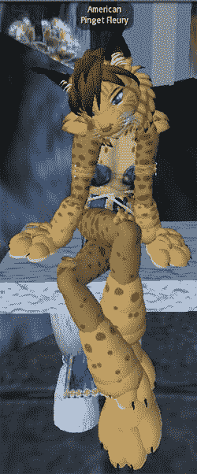

# 詹姆斯·瓦格纳致《第二人生》营销人员:别傻了

> 原文：<https://web.archive.org/web/http://techcrunch.com/2007/07/13/james-wagner-au-to-second-life-marketers-dont-be-stupid/>

# 詹姆斯·瓦格纳对第二人生营销人员说:别傻了

每个人都喜欢的游戏作家(在彼得·苏休之后)，詹姆斯·瓦格纳·奥，着手揭穿关于第二人生*的五大神话。他揭穿的神话——它有 50 亿人口或 5 个孤独的怪人，它充满了色情、阴茎和跳舞的外阴等。—针对的是那些可能想在世界上做广告，却被跳舞的女人吓跑的营销人员。*

 *如果你关心《第二人生》的营销，这是一本好书，但最好的部分之一是在跳跃之后。他基本上是说，如果你想的话，你可以把跳舞的 vulvas 完全拒之门外，这样你就可以在第二人生里为芬达做广告，就像在电视上做广告一样。科技不是很伟大吗？

> 与此相关的是，大多数“破坏”涉及非永久性的特殊效果，如果土地所有者使用现有的土地管理控制措施来管理其财产上未经授权的内容创作，这些效果本来是可以完全防止的。(这包括一些臭名昭著的案例，比如飞行阴茎包围 CNET 的办公室，或者污损参议员 Edwards 的非官方 SL 竞选总部。)有些记者漏掉了这个细节。这就像一个真实世界的店主离开他的商店，无人看管，没有上锁，警报也被禁用，然后在一夜之间这个地方被洗劫一空，随后的新闻报道指责他的房东。有时，蓄意破坏甚至被断言为不存在的——比如广泛传播的关于一枚“核弹”摧毁了澳大利亚 ABC 岛的报道——后来证明这是一次非恶意的服务器崩溃。

揭穿关于第二人生的 5 个商业神话*