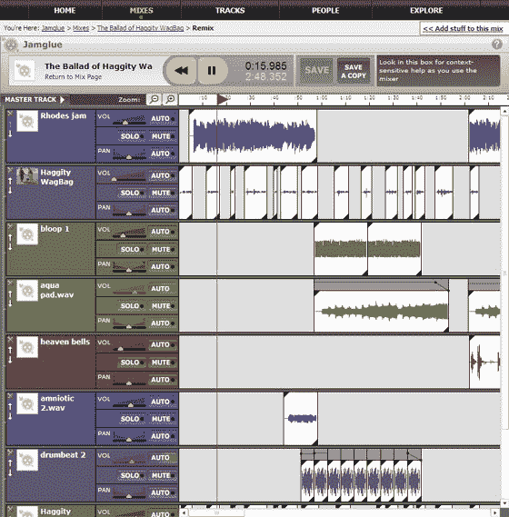

# JamGlue 推出“面向大众的混音”

> 原文：<https://web.archive.org/web/http://www.techcrunch.com:80/2006/12/15/jamglue-launches-remixing-for-the-masses/>

# JamGlue 推出“面向大众的混音”

[jam glue](https://web.archive.org/web/20221205072434/http://jamglue.com/)[y combinator](https://web.archive.org/web/20221205072434/http://www.beta.techcrunch.com/2006/11/09/the-y-combinator-companies/)公司之一，今日公开上市。JamGlue 是一个在线社区，类似于 [SpliceMusic](https://web.archive.org/web/20221205072434/http://splicemusic.com/) ，在这里你可以听或者混合来自一个音乐曲库和其他混音的音乐。JamGlue 最初处于私人测试阶段，有 2500 名成员和 1500 首曲目的基本库。

JamGlue，正如他们的口号所暗示的，是通过他们基于 Flash 的混音板提供“大众混音”。该委员会比它的拼接音乐对手圆滑得多。关键的区别是，它可以扩展到你的浏览器窗口，允许你添加无数的曲目到一个组合中，可以嵌套在组中，放大和缩小曲目，并在播放时对组合的变化做出反应。JamGlue 在最初 18，000 美元的预算和一点自己的资金基础上完成了这一切。然而，Splicemusic 支持节拍匹配并在音序器中录制您自己的声音。

这两个网站都允许你重新混合其他用户的混音。JamGlue 通过生成包含对原始声音剪辑和音轨的所有编辑的混音的 XML 文件表示来实现这一点。当你完成后，JamGlue 和 SpliceMusic 都会控制最终的混音，并让你将你的杰作下载为 mp3。然而，JamGlue 的音轨嵌套使得管理添加到现有混音或由多个混音组成的混音变得更加容易。从网站上听一些我最喜欢的。

[http://static.jamglue.com/flash/inline-mix-player.swf?1165951317](https://web.archive.org/web/20221205072434/http://static.jamglue.com/flash/inline-mix-player.swf?1165951317)

[http://static.jamglue.com/flash/inline-mix-player.swf?1165951317](https://web.archive.org/web/20221205072434/http://static.jamglue.com/flash/inline-mix-player.swf?1165951317)**[帮助我某人](https://web.archive.org/web/20221205072434/http://www.jamglue.com/mixes/642) ** 乘  [丛林之狐](https://web.archive.org/web/20221205072434/http://www.jamglue.com/people/bushofghostsremix) 

围绕衍生作品建立的社区回避了一个大问题:版权？接近劳伦斯·莱斯格的“撕-混-烧”理念，JamGlue 和 Splice 都使用了创作共用许可协议。JamGlue 将其分解为五个不同的许可证，这些许可证总是允许重新混合，但也控制原始许可证的商业使用和修改。他们还通过尊重 DMCA“安全港”规定下的卸货请求和用户标记来寻求保护。

在发布会上，JamGlue 还将与前瞻性思维的 netwerk 音乐唱片公司举行音乐混合比赛。潜艇乐队的歌曲“和平与仇恨”将被放在创作共用许可下的砧板上，供社区混合和捣碎。六种最受欢迎的混音的制作者将获得奖品。

更多关于 Creative Commons 的信息，请登陆[ccMixter.org](https://web.archive.org/web/20221205072434/http://ccmixter.org/)。

