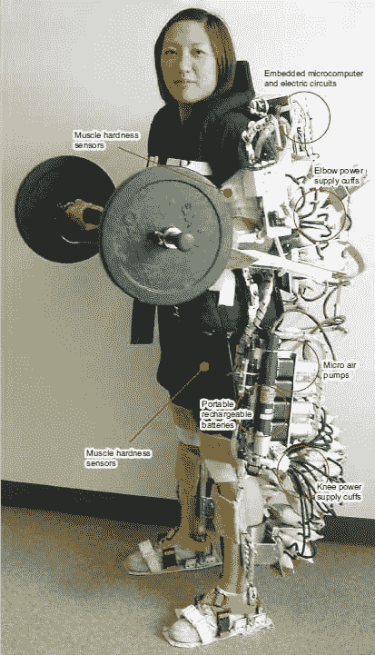

# 日本动力服让你成为超级人类

> 原文：<https://web.archive.org/web/http://techcrunch.com/2006/09/29/japanese-power-suit-makes-you-super-human/>

# 日本动力服让你超有人情味

日本科学家开发了一种新的“可穿戴动力服”，让你看起来很像终结者。这套服装是为疗养院设计的，那里的员工会穿着它来运送病人。我一直认为床是为了这个目的而滚动的，但我想这已经不够好了。便携式电池、微型气泵和小型身体传感器的组合可以帮助你以一半的努力举起 180 磅的重量，这是电力前的衣服。当前型号的唯一缺点是 30 分钟的电池寿命，但该套装背后的工程师表示，未来的版本可以帮助老年人或残疾人行走，而不是简单地由穿着该套装的其他人携带。

新的动力服增强了人类的力量