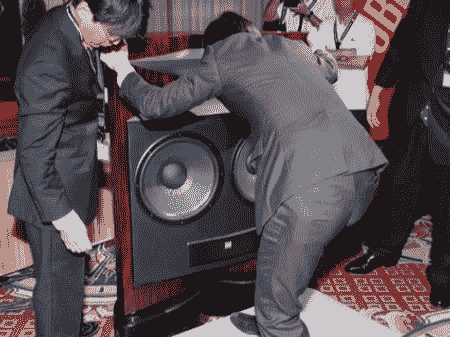

# JBL 攀登珠穆朗玛峰

> 原文：<https://web.archive.org/web/http://techcrunch.com:80/2006/09/08/jbl-tackles-mt-everest/>

好吧，所以从技术上来说，他们只是做了一些名为珠穆朗玛峰的扬声器，但它们的重量是 313 磅，对一些人(我)来说就像一座山一样重。珠穆朗玛峰扬声器的功率为 500 瓦，尺寸高达 9 英寸 x 18.5 英寸 x 44 英寸。因此，如果你有 3 万美元来购买它们，我希望你有很多多余的空间。

我们在日本的朋友将能够在 9 月 21 日购买珠穆朗玛峰。我打算进口七个，单独用这些怪物做一个环绕系统。是啊。有人想推荐一个好的接收器吗？

 [珠穆朗玛峰 JBL 演讲者](https://web.archive.org/web/20150919044324/http://www.ubergizmo.com/15/archives/2006/09/mt_everest_jbl_speakers.html)【UberGizmo】