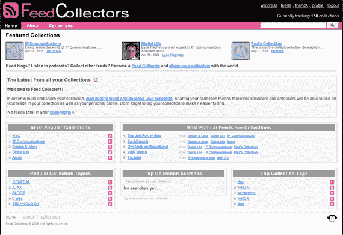

# 杰夫·普尔弗的饲料收集器测试版| TechCrunch

> 原文：<https://web.archive.org/web/http://www.techcrunch.com/2006/05/25/jeff-pulvers-feedcollectors-beta/>

[feed collectors](https://web.archive.org/web/20150924122539/http://feedcollectors.com/)，私下内测，是杰夫·普尔弗新项目[之一。就像戴夫·维纳的《分享你的 OPML》一样，FeedCollectors 为用户提供了一个上传他们阅读的 OPML 文件的机制。](https://web.archive.org/web/20150924122539/http://pulverblog.pulver.com/)

不过，与 SYO 还是有细微的不同。Feedcollectors 也是一个社交网络，你可以添加朋友，看看他们在读什么，用户也可以创建公共收藏，这是基于主题的 feed 收藏。最受欢迎的收藏名为“NYC ”,有许多关于这个城市的博客。用户可以对每个收藏集进行标记、评级和评论。

到目前为止，共有 150 个收藏来自访问该网站的有限数量的用户。像 SYO 一样，FeedCollectors 正在使用这些 feed 数据来生成关于人们阅读行为的有趣数据。

我最喜欢这些服务的一点是，一旦统计上相关数量的人上传了他们的数据，这些数据就产生了。看到人们真正在读什么，深入长尾理论，是令人信服的东西。

