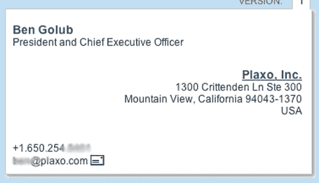
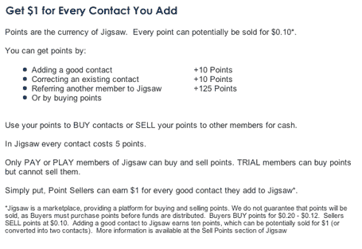

# 拼图是一个非常非常糟糕的主意 

> 原文：<https://web.archive.org/web/http://www.techcrunch.com/2006/03/23/jigsaw-is-a-really-really-bad-idea/>

  嗯，就在一家公司[不再作恶](https://web.archive.org/web/20230216140840/https://techcrunch.com/2006/03/22/plaxo-now-with-less-evil/)的时候，另一家公司已经取而代之。 [Jigsaw](https://web.archive.org/web/20230216140840/http://www.jigsaw.com/) 是一个联系信息的**市场，它非常高效。它拥有 250 万人的详细个人联系信息，每天新增 7000 人。如果你想要任何公司的任何高管的姓名、头衔、电子邮件地址、直拨电话和/或地址，Jigsaw 很有可能已经在它的数据库中有了这些信息，并会卖给你。如果你是一名销售人员，并且对你从哪里获得联系信息没有道德顾虑，你可能已经了解了 Jigsaw。**

不像 Hoovers 和 InfoUSA 这样的竞争对手，他们通过半合法的方式收集公司信息，如搜索 SEC 文件，打电话给公司询问信息，以及审查其他公共文件， **Jigsaw 只是付钱让人上传其他人的联系信息**。用户每上传一个联系人就可以获得 1 美元的报酬，有些用户已经上传了数万人的信息。[参见演示](https://web.archive.org/web/20230216140840/http://www.jigsaw.com/demo/online_demo_home.html)(请注意该页面上的其他演示)。Jigsaw 还可以自我纠正，并激励人们纠正错误的联系信息。

没错，下次你给别人递名片或者透露你的联系方式时，你可能会把它发给全世界。

它是这样工作的:注册并开始下载联系信息。这包括姓名、头衔、公司、地址、电子邮件和直拨电话。例如，快速搜索会显示 Plaxo 首席执行官 Ben Golub 的所有个人联系信息(已适当涂抹):

但是等等，还有更糟的。

任何人都可以通过主页上的链接找到 Jigsaw 是否有他们的联系信息，但修改或试图删除这些信息只是在数据上加上一个标记，注明所做的更改，但原始信息仍然保留。一旦有人将你的联系信息输入到他们的数据库中，似乎就没有办法从 Jigsaw 中删除了。我在网站上找不到这样做的方法(包括在隐私政策中)，给该公司发的询问此事的电子邮件也没有得到回复(现在已经过去三个工作日了)。

Jigsaw 有一个措辞谨慎的隐私政策，以应对他们是隐私的对立面这一事实。他们说“本隐私政策涵盖了我们收集、使用和共享用户信息的方式、时间和原因……**本政策不适用于我们收集和使用数据库系统**中包含的公司和联系人数据。”

拼图合法吗？也许在美国，虽然我很想看到他们被集体起诉。这合乎道德吗？绝对不行。每个 Jigsaw 的员工和投资者都有肮脏的手，他们应该为自己感到羞耻。

和 Plaxo 一样，Jigsaw 赚钱的同时也把成本推给了其他人。在 Plaxo 的例子中，它是垃圾邮件。在 Jigsaw 的例子中，它公开了私人联系信息。这里的问题是，Jigsaw 的行为不容易被不断接到陌生电话和电子邮件的人发现——他们不太可能知道这些人最初是在 Jigsaw 获得这些联系信息的。

如果他们想做好这件事，他们会建立一个市场，个人可以选择出售(或赠送)他们的联系信息。数据的所有者可以设定价格，Jigsaw 可以从中提成。这种模式可行吗？也许不是，但这恰恰证明了我的观点。Jigsaw 成功的唯一原因是他们不必承担推给第三方的成本——所有在他们数据库中的人。

管理团队和投资人[都在这里](https://web.archive.org/web/20230216140840/http://www.jigsaw.com/contactus/Management.html)。

**更新:** Rafe Needleman 在电子邮件中提到了他在 2004 年末写的一篇关于 Jigsaw 的文章。他称之为“聪明但令人毛骨悚然”，并表示“我不赞同竖锯的道德立场”。我同意。