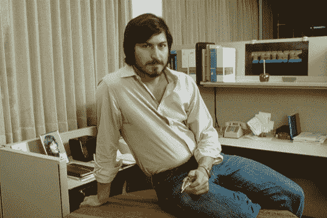

# 乔布斯的苹果手机

> 原文：<https://web.archive.org/web/http://techcrunch.com/2007/06/18/jobs-iphonefolly/>

现在它把洗液放在篮子里。

约翰·海勒曼写的大多是政治，但喜欢时不时地往科技饮料碗里扔一坨屎，他写了一份关于这个我们称之为“乔布斯”的人的相当有趣的简介我们都知道这个故事——书呆子造电脑，书呆子卖电脑，运动员偷电脑，书呆子又把电脑偷回来。但海尔曼关注的是现实扭曲领域，以及乔布斯实际上是一个混蛋，他的公司正面临着历史上最艰难的时期。

> 贯穿这三幕的主线是乔布斯的独特个性。他的弥赛亚精神从一开始就存在:“他一直相信，”沃兹尼亚克说，“他将成为人类的领袖。”然而，无论是朋友还是敌人，甚至是乔布斯本人，对他最常用的描述都是“混蛋”。(并列第二的是“天才”和“反社会者”)他的研磨性是传奇的，全方位的。被《连线》的一位作家问到“如果你能回到过去给 25 岁的自己提建议，你会说什么？“乔布斯爆发了，”不要处理愚蠢的采访——我没有时间听这些哲学废话！”由于对 Segway 高科技旅客捷运系统的初步了解，他吼道，“我认为它糟透了，”后来他打电话给该公司的创始人，骂他的首席执行官是“笨蛋”，并说他的营销主管“应该在爱达荷州的折扣店卖纸巾。”

不错！然后他继续谈论 iPhone，以及它如何在艰难的市场中竞争等等。海尔曼说“乔布斯以前也犯过错误。如果事实证明 iPhone 令人失望，他的声誉将急剧下滑:从一个从不犯错的梦想家变成又一个野心勃勃的大亨。”那是他的结论，我完全不同意。虽然我们大多数人在[对 iPhone 的价值持观望态度，但我相当肯定它会是一个伟大的 iPod。苹果现在唯一可能发生的事情就是遭遇一段缓慢而稳定的衰落期，就像 IBM 一样。iPhone 是一种追赶型设备，这个行业不喜欢早出晚归的人。如果苹果继续做这种事情——在曲线后推出半生不熟的设备“只是为了安全”——那么海利曼的可怕预言将成为现实。在那之前，你们最好去当地的 T 店。我听说他们已经在排队了。](https://web.archive.org/web/20140311002709/http://crunchgear.com/2007/06/14/the-futurist-why-the-iphone-reeks-of-planned-obsolescence/)

史蒂夫·乔布斯在盒子里