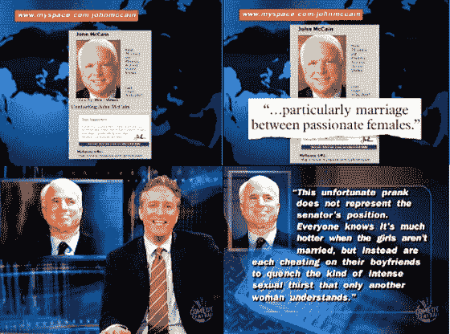

# 约翰麦凯恩的 MySpace“增强版”成为每日秀 

> 原文：<https://web.archive.org/web/http://www.techcrunch.com:80/2007/03/29/john-mccains-myspace-enhancement-makes-daily-show/>

# 约翰·麦凯恩的 MySpace“增强版”成为每日秀

周四晚上的每日秀节目中提到了 [Newsvine](https://web.archive.org/web/20220926211323/http://www.newsvine.com/) 首席执行官 Mike Davidson 对总统候选人 John McCain 的网站所做的[改进](https://web.archive.org/web/20220926211323/http://www.beta.techcrunch.com/2007/03/27/john-mccains-myspace-page-hacked/)。其他主流媒体也很关注。戴维森的股东应该感到高兴——这对 Newsvine 来说是一次重大的游击营销活动。

截图和视频在下面。

[http://www . comedy central . com/motherload/syndicated _ player/index . jhtml](https://web.archive.org/web/20220926211323/http://www.comedycentral.com/motherload/syndicated_player/index.jhtml)