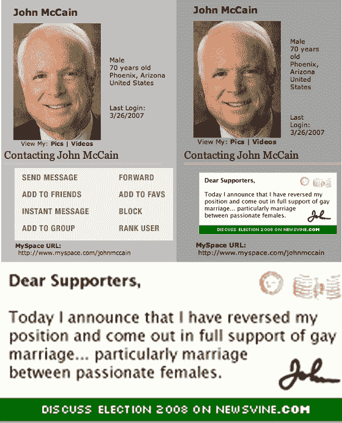

# 约翰·麦凯恩的 MySpace 页面“增强版”TechCrunch

> 原文：<https://web.archive.org/web/http://www.techcrunch.com:80/2007/03/27/john-mccains-myspace-page-hacked/>

# 约翰·麦凯恩的 MySpace 页面“增强版”

总统候选人约翰·麦凯恩的工作人员中有人今天会有麻烦。他们用一个众所周知的模板创建了他的 [Myspace 页面](https://web.archive.org/web/20230202235704/http://www.myspace.com/johnmccain)。模板由 [Newsvine](https://web.archive.org/web/20230202235704/http://www.newsvine.com/) 创始人兼 CEO 迈克·戴维森(原模板为[此处为](https://web.archive.org/web/20230202235704/http://www.myspace.com/mikeindustries))设计。戴维森把模板代码给了任何想使用它的人，但要求在使用时给予他信任，并告诉用户保存他们自己的图像文件。

麦凯恩的工作人员使用了他的模板，但没有给戴维森信用。他说，更糟糕的是，他们使用他服务器上的图像，这意味着他必须为麦凯恩网站的页面浏览量所使用的带宽付费。

戴维森决定今天早上在竞选活动上搞一个小恶作剧作为报复。由于他控制了网站上的一些图片，他用一句话取代了显示联系信息的图片:

> 今天我宣布我已经改变了立场，公开表示全力支持同性婚姻……尤其是两个充满激情的女性之间的婚姻。

这个故事也在 Newsvine [这里](https://web.archive.org/web/20230202235704/http://mike.newsvine.com/_news/2007/03/26/633799-hacking-john-mccain)。这让我想起了一个类似的情况，当时微软未经所有者 Niall Kennedy 的许可，在其博客上使用了 Flickr 上的一张图片。Niall 把图片换成了色情图片，然后发布在博客上。他的想法是向微软传达尊重知识产权许可的重要性，尽管有些人认为这很幼稚。

麦凯恩的 MySpace 页面比微软的博客更引人注目，戴维森也没有在网站上发布色情内容。他在发表政治声明的同时，也传达了尊重他人财产权的信息。我希望这种变化能很快逆转，除非这个错误的人生病了或者今天出去吃午饭了。不管怎样，我们已经在上面捕捉到了。