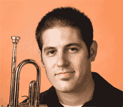

# 和我一起欢迎……|技术危机

> 原文：<https://web.archive.org/web/http://techcrunch.com/2006/11/30/join-me-in-welcoming/>

…我们最新的克朗彻奇记者。赛斯是前《T1 男性健康》( T2)的作家，他将于下周发布一个新专栏关注未来，迈克在 PC Mag 工作，直到他们不再关心音频，他现在也将为我们关心音频，而彼得·苏休是游戏大师，他在任天堂有足够的影响力让他的脸在《T3 超级马里奥 2 》( T4)中叠加在布瑟身上。说真的。继续阅读他们的完整简历，不要忘记[布莱斯](https://web.archive.org/web/20130627204300/http://www.brycedurbin.com/)，我们的快克鱿鱼插画谁是寻找自由职业者的工作。

***[彼得·苏休](https://web.archive.org/web/20130627204300/http://crunchgear.com/author/peter)*——游戏**

彼得·苏休是纽约的自由撰稿人，十多年来一直报道消费电子、技术、电子娱乐和玩具行业。在此期间，他的作品出现在三十多种出版物中，包括《新闻周刊》、《个人电脑杂志》、《笔记本电脑》、《个人电脑升级》、《花花公子》、《连线》、《FHM》、《SPIN》、《VIBE》、《纽约每日新闻》和《电脑游戏》。他为《电子游戏月刊》、《宽屏评论》、《声音与视觉》和《官方 PlayStation 杂志》报道了家庭娱乐和视频游戏的趋势。他的作品还出现在 Forbes.com、Inc.com、Cnet.com、CNN.com，并且是 GameSpy.com 的常客。2004 年，彼得与人合著了《计算机游戏行业的职业生涯》(新经济系列中的职业生涯)，这是罗森出版社针对高中生的职业指南。

在两年半的时间里，彼得是 FoxNews.com 的一名技术记者和网络制作人，之前是康纳斯通信公司营销和公共关系公司的互联网顾问和新媒体专家。彼得·苏休还担任游戏设计和营销的独立顾问。

电子邮件:网站 crunch gear 的彼得

***[迈克·柯宾](https://web.archive.org/web/20130627204300/http://crunchgear.com/author/mike)*–音频**

迈克·科布林(Mike Kobrin)是纽约市的自由作家和编辑，他还在各种乐队演奏小号和电贝司。他经常出现在广播和电视上，以及印刷和网络上，分享他在数字音频和数字摄影方面的专业知识，他最近是 PC Magazine 和[PCmag.com](https://web.archive.org/web/20130627204300/http://www.pcmag.com/)音频产品的首席分析师。

电子邮件:麦克在 crunch gear dot com

***[塞思猪](https://web.archive.org/web/20130627204300/http://crunchgear.com/author/seth)***

Seth Porges 是一位居住在纽约的作家。他的作品出现在数十种出版物上，包括《男性健康》、《男性杂志》、《个人电脑杂志》和《商业周刊》。

电子邮件:seth 在 crunch gear dot com