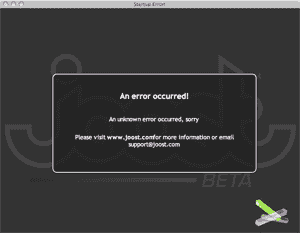

# Joost，她快死了

> 原文：<https://web.archive.org/web/http://techcrunch.com:80/2007/05/04/joost-she-is-dying/>

# 约斯特，她快死了

我知道，我知道:我欠你们约斯特邀请。下周我会试着把一些东西放在一起，但正如我们今天所学的，这项服务负担过重。据 NewTeeVee 的 Liz 称，他们的英特尔 MAC 电脑遇到了各种问题，Joost 正在调查这些问题。

上周我试了一下 Joost，我发现它相当有用，虽然有点傻。在电脑上看电视很难。如果你没有完全全神贯注，你基本上是在为自己制造白噪音，如果你全神贯注，你就没有做任何工作。我认为这是一个令人信服的想法——从头开始建立一个家酿广播服务——但我担心它的长期价值。

Joost 容易出错