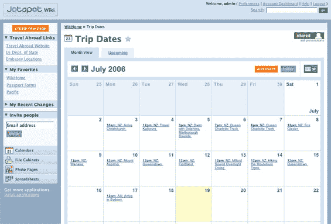
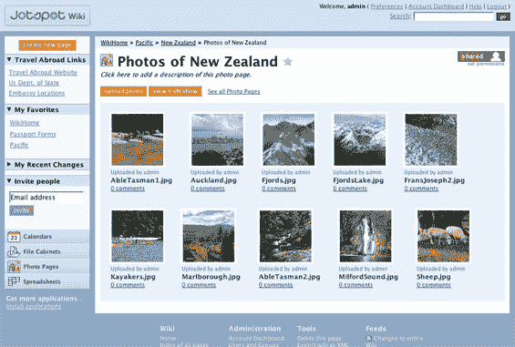

# Jotspot 2.0 发布 TechCrunch

> 原文：<https://web.archive.org/web/http://www.techcrunch.com:80/2006/07/24/jotspot-20-launches/>

  位于帕洛阿尔托的 [Jot](https://web.archive.org/web/20221225131210/http://www.jot.com/) 正在推出 [Jotspot 2.0](https://web.archive.org/web/20221225131210/http://front.jot.com/press/) ，这是对他们托管的维基解决方案的重大升级。

上周，我们会见了首席执行官乔·克劳斯(Joe Kraus)，演示新产品(并讨论了 5 月份的雅虎收购传闻，该传闻被断然否认)。

 Jotspot 2.0 采用了现有的大部分非结构化的 Jotspot wiki 应用程序，并添加了类似 Office 的功能。其结果是一个 wiki，允许用户添加结构化页面，如日历、电子表格、文件存储库、文档和照片库。该服务的定价保持不变，根据用户、页面和存储空间，有免费版本和每月高达 200 美元的高级选项。

有了这些改变，我们认为 Jotspot 是最好的面向商业的托管 wiki。Jeremy Zawodny [也喜欢它](https://web.archive.org/web/20221225131210/http://jeremy.zawodny.com/blog/archives/007062.html)，但是认为如果他们不再称它为 wiki，他们会更成功。

Jotspot 也在测试安装在用户服务器上的非托管版本的 wiki。

Jotspot [上的 TechCrunch 帖子在这里](https://web.archive.org/web/20221225131210/http://techcrunch.com/tag/jotspot)。

