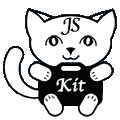

# JS-Kit:懒人的 Web 2.0 TechCrunch

> 原文：<https://web.archive.org/web/http://www.techcrunch.com:80/2007/04/23/js-kit-web-2-for-lazy-people/>

# JS-Kit:懒人的 Web 2.0

 去年 11 月，我们第一次[谈到了](https://web.archive.org/web/20220927053741/http://www.beta.techcrunch.com/2006/11/29/quick-embed-code-to-add-comments-to-any-site/) [JS-Kit](https://web.archive.org/web/20220927053741/http://js-kit.com/) ，当时我们谈到了他们的快速嵌入代码，可以让你向任何接受 JavaScript 的网站添加评论。从那以后，JS-Kit 一直在创建更多的小部件，使得向任何站点添加用户交互变得非常简单(每个小部件 2 行代码)。JS-Kit 在增加了 Filmloop(今年早些时候[关闭了](https://web.archive.org/web/20220927053741/http://www.beta.techcrunch.com/2007/02/12/filmloop-betrayed-by-investors/))12 名工程师中的 5 名后，也从一个独角戏发展成了一个完整的公司。从那以后，他们每两周就推出一款新的产品。

JS-Kit 正在开发一套小工具，帮助网站所有者优化他们的网站内容，最终允许网站所有者根据人们如何浏览他们的网站来轻松优化他们的网站。想想 [Baynote](https://web.archive.org/web/20220927053741/http://baynote.com/) ，不过对于小家伙来说。

JS-Kit 目前的 widget 套件包括[评论](https://web.archive.org/web/20220927053741/http://js-kit.com/comments)，五星[评级](https://web.archive.org/web/20220927053741/http://js-kit.com/ratings)，以及本周增加的一个[投票](https://web.archive.org/web/20220927053741/http://js-kit.com/polls) widget。新的投票小部件支持无限数量的问题和截止日期，只有在网站所有者发布后才可见。每个小部件都有一个完全可定制的 CSS 外观，由两行代码组成。第一行是一个“div”标记，第二行 JavaScript 代码赋予了它生命。

默认情况下，每个小部件都通过它所在页面的 URL 来区分，但也可以由用户给一个唯一的标识符，以便一个页面可以有一个小部件的多个实例，如创始人 Lev Walkin 的[照片网站](https://web.archive.org/web/20220927053741/http://lionet.info/photos/tlc/)。JS-Kit 通过记录用户 cookies、IP 和用户代理的组合来打击欺诈。管理员可以调节这种安全性的程度。然而，JavaScript 实现的一个主要缺点是它不能在破坏 JavaScript 代码的站点(MySpace)上运行。

每个小工具也有管理能力，由 cookie 分配给第一台访问小工具代码的计算机。管理员可以对 Akismet 的垃圾邮件过滤器可能遗漏的任何评论进行审核，或者创建新的投票。JS-Kit 有一个用户设置页面，让您可以查看您在 JS-Kit 站点上的活动，并在您切换计算机或丢失 JS-Kit cookie 时收回某个域的管理员权限。

为了让这些不仅仅是网站 web 2.0 的“闪亮”，JS-Kit 让这些小部件相互交流。到目前为止，他们已经将评论和评级集成到一个小部件中，允许人们留下评论和他们的个人评级，这些评论和评级在服务器端结合成小部件所附对象的一个整体评级。在这些小部件之上，JS-Kit 将在本周晚些时候发布一个元小部件，这样冲浪者就可以收到对你网站热门内容的推荐(见右图)。

跳转后的评论和评分小工具……