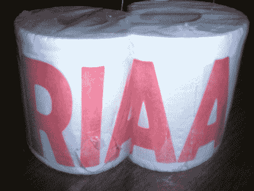

# 法官挫败 RIAA 计划，以确定选择大学生

> 原文：<https://web.archive.org/web/http://techcrunch.com/2007/07/16/judge-foils-riaa-scheme-to-identify-select-college-students/>

RIAA 的又一次挫败，Slashdot 的又一次胜利。一名联邦法官裁定，在确定威廉玛丽学院“音乐窃贼”的身份时，音乐产业不能单方面要求发现*。部分原因是法官认为 RIAA 在诉讼中引用了错误的法律。在英语中，这意味着 RIAA 无权仅仅因为提起诉讼就获得学生的个人信息。*

 *因此，如果你参加了威廉和玛丽学院，点燃 Azureus，并在它。我会向你们其他人推荐新闻组，但是新闻组警察会找上我。我不需要那个了。

法官再次打击 RIAA 反对校园文件共享的战争*