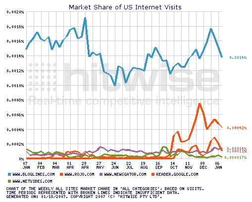

# 谷歌阅读器到底有多大？–TechCrunch

> 原文：<https://web.archive.org/web/http://www.techcrunch.com:80/2007/01/19/just-how-big-is-google-reader/>

# 谷歌阅读器到底有多大？

谷歌的 RSS 阅读器在 2005 年 10 月第一次[推出](https://web.archive.org/web/20220818075214/http://www.beta.techcrunch.com/2005/10/08/google-reader-beautiful-needs-work/)时没什么值得大书特书的。但是去年年底发布的新版本为它赢得了赞誉和大批新粉丝。不少人最近称它为最好的 RSS 阅读器，毫无疑问。

但是很难知道它到底有多受欢迎。Feedburner 还没有跟踪它，所以我们无法将订阅者数量与其他读者进行比较。不过，我们注意到谷歌阅读器的推荐量大幅上升。足以表明它已经和 Bloglines 一样大或者更大了。

Hitwise 可不这么认为。在今晚的一篇比较网络阅读器的文章中，他们认为博客和罗约遥遥领先于谷歌阅读器。一般来说，Hitwise 似乎是在钱上，但有些东西不加起来。

一个半显而易见的解释是，Google Reader 比 Bloglines 需要更少的页面刷新。这将减少他们的页面浏览量，但不会减少访问量，而访问量正是 Hitwise 追踪的。我们可能需要等到 Feedburner 开始直接追踪 Google Reader 来三角测量它真正的受欢迎程度。

