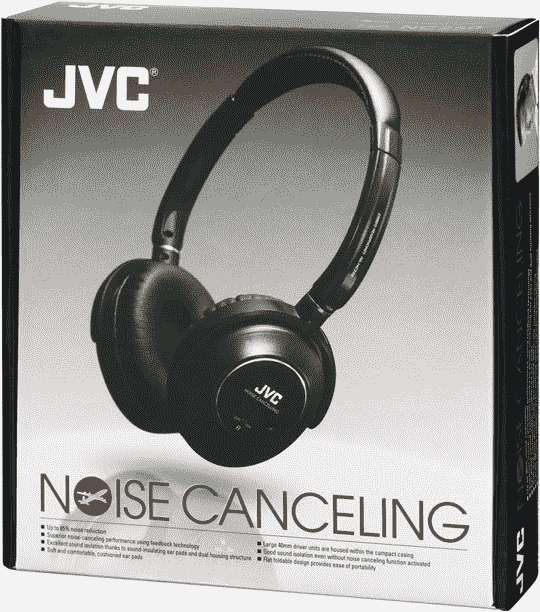

# JVC 宣布推出降噪耳机| TechCrunch

> 原文：<https://web.archive.org/web/http://techcrunch.com/2007/07/13/jvc-announces-noise-canceling-headphones/>

# JVC 宣布推出降噪耳机

拿着一盒 1983 年的直出，不会错的

今天是超级星期五！你们知道这意味着什么，伙计们。真正令人兴奋的小工具的时间到了！今天，我们有 JVC HA-NC250 耳机，具有“最先进的”噪音消除功能。JVC 是如何完成这一壮举的？:

> HA-NC250 的噪声消除电路包括持续监控噪声消除过程的反馈技术。因此，耳机消除了高达 85%的外来背景噪音。为了进一步阻挡噪音，HA-NC250 提供了两项 JVC 创新，有助于将听者与外界声音隔离开来。首先，每个耳机都采用了双层外壳结构，增加了隔音层。其次，JVC 开发了一种新技术，将耳机光滑的记忆泡沫缓冲耳垫连接到外壳上，有助于隔离背景噪音。光滑的垫子也提高了舒适度。这些已申请专利的隔音功能尤为重要，因为 HA-NC250 可以在主动噪音消除关闭的情况下使用。

这款耳机在每个听筒中使用 50 毫米钕驱动器，以获得清晰的声音。你可以把它们折叠起来，扔进附带的手提箱里，考虑到这些宝贝价值 199.95 美元，你会想这么做的。八月下旬，你可以在任何卖电子产品的地方买到一双。

[新闻稿](https://web.archive.org/web/20130628210449/http://vpo3.virtualpressoffice.com/document.jsp?id=1184050872532)