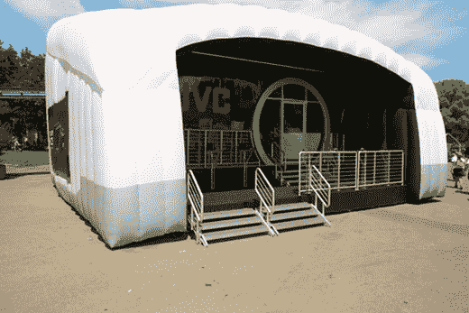

# JVC 游览美国中心地带，展示其高清产品

> 原文：<https://web.archive.org/web/http://techcrunch.com/2007/06/04/jvc-tours-american-heartland-showing-off-its-hi-def-goodies/>

哟嗬，伙伴们！合资公司将在全国各地的县集市、气球节和航空展上向公众展示其全新的产品，不需要花哨的媒体通行证。被称为“聚焦高清”之旅，它将在 24 个州的约 50 场活动中停留，让人们看到，听到，触摸，品尝和闻到 JVC 的小玩意，重点是高清的。去吧，惊叹于它的高清电视和摄像机等等。该公司有一辆装满各种电子产品的大巴士供你奉承，直到 11 月份在拉斯维加斯的最后一次展览。

旅行的第一站是内布拉斯加州奥马哈的“奥马哈味道”活动。我在 CG 总部附近看到一些事件。谁想和我们一起烧烤看猪在泥里打滚？

[聚焦高清之旅](https://web.archive.org/web/20141017003034/http://www.jvchdtour.com/)【JVC】