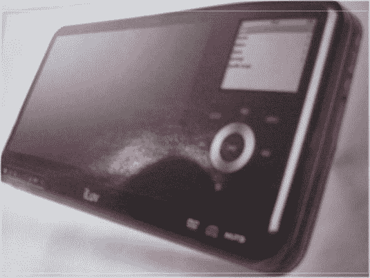

# JWin iLuv 蓝牙音响系统| TechCrunch

> 原文：<https://web.archive.org/web/http://techcrunch.com/2007/01/08/jwin-iluv-bluetooth-audio-system-draft/>

JWin 今天公布了他们的 iLuv i199 蓝牙音响系统。作为无线音乐设备，你可以通过蓝牙将你的 iPod、收音机、CD 或任何东西传输到一组无线扬声器或耳机。JWin 使用其 BluePin 无线音频发射器/接收器从您的设备接收音乐，然后通过蓝牙连接传输音乐。你可以把音乐从你的牢房传到 iLuv。我是说，多神奇啊？我相信精益烹饪很棒。

iLuv hi-fi 系统配有一个外观精美的手持设备，可以无线控制你的音乐，总价格为 199 美元。对于一个可以播放音乐和视频的设备来说，这并不算太糟糕，因为它内置了液晶显示屏。如果你想买的话，一月底就可以买到。(在地板上看到会有更好的 pic！)