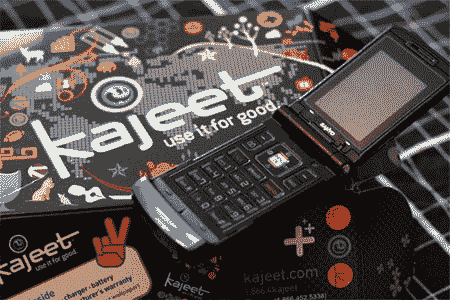

# 卡吉特:你知道，对孩子们来说

> 原文：<https://web.archive.org/web/http://techcrunch.com/2007/03/19/kajeet-you-know-for-kids/>

三洋武士刀——小孩会踩在上面折断它吗？我的几乎做到了！

我刚接到一个有趣的 MVNO，Kajeet 的电话。这项服务的目标是孩子和他们的父母，并提供一些父母可能会喜欢的基本功能。

Kajeet 目前提供三洋武士刀，LG LX150 和 225，以及诺基亚 6165i。每个“套件”都附带 5 美元的播放时间，一些贴纸，以及一个听起来很酷的笨拙尝试，据我所知，这可能对青少年有效，但肯定会影响 13 岁及以上儿童的审美。

贴纸！为了你的手机！手机贴纸！
服务相当标准。手机价格从 49.99 美元到 99.99 美元不等，Kajeet 提供免费送货服务。语音通话每分钟 10 美分，短信每条 5 美分。有一个 35 美分的每日使用费，这可能会吃你的乐趣，但提供代替取消费用。Mobile AIM 每月收费 6.99 美元，铃声和壁纸等所有标准垃圾内容只需几美元。

阻止小强尼凌晨 3 点给斐济打电话。

然而，真正吸引人的是家长控制。父母可以屏蔽某些号码，确保孩子只能拨打几个预设的号码，而不能使用自己的“钱包”，并为熄灯后可能有点太健谈的孩子设置停电时间。父母可以创建他们自己的钱包，让孩子在他们自己的钱用完时有一点零钱，你可以用信用卡在线充值。

日常使用费疼。

Kajeet 似乎是硬件和软件的有趣结合，确保孩子们可以打电话，但不会用高额费用动摇他们父母的账户。然而，家长们要注意了。人物和“卡吉特·ROX 4U！”设计有点令人厌烦。我猜他们把这些东西集中在一起，但是像“手机 4U”这样的台词让我有点头晕。

法律的东西很难！

[产品页面](https://web.archive.org/web/20160407222502/http://www.kajeet.com/mainMenu.html)