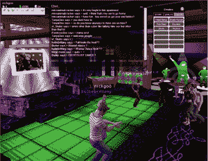

# kaneva :( 3D)朋友的地方 

> 原文：<https://web.archive.org/web/http://www.techcrunch.com:80/2007/03/16/kaneva-a-place-for-3d-friends/>

# kaneva :( 3D)朋友的地方

 [Kaneva](https://web.archive.org/web/20221001070513/http://kaneva.com/) 是一个新的社交网络，它将 [MySpace](https://web.archive.org/web/20221001070513/http://www.beta.techcrunch.com/2007/03/15/snocap-announces-alliances-with-major-labels/) 的概念扩展到了虚拟世界。虽然你已经可以在 Kaneva 上注册 2D 的个人资料，但他们最近打开了他们 3D 世界的大门。这个想法是，用户可以在 2D 空间创建个人资料页面，就像 MySpace 一样，但也可以对他们的虚拟世界公寓进行同样的个性化。

这个社交网站充满了 MySpace 的所有主要功能:朋友、照片、视频、消息、群组和个人博客。Kaneva 还让您控制您的主页和个人资料的外观，使用 AJAX 编辑器将模块放入页面。如果你真的想复制你的 MySpace 的可怕布局，你也可以直接用 CSS 来装饰你的个人资料。下面是[和](https://web.archive.org/web/20221001070513/http://www.kaneva.com/channel/kewlchique.people)的示例简介。与 MySpace 不同，Kaneva 还包括一个名为“raves”的投票系统，用来标记最佳的个人资料、群组、照片和视频。

 虚拟世界有一种小人或 There.com 看向它。世界的建筑是基于不同的公共场所(商场、俱乐部……)和你的私人公寓。用虚拟货币购买商品。该网站为你的头像提供了一些基本的头发、颜色、身体和形状定制，但要赶上更成熟的 [SecondLife](https://web.archive.org/web/20221001070513/http://www.beta.techcrunch.com/2007/02/10/second-life-census/) 还有一段路要走。你的私人公寓就像你的“3D 档案”，你可以装饰它，用来举办派对。

然而，真正有趣的部分是 Kaneva 如何将他们的 2D 和 3D 世界联系在一起。用户不仅可以用电视和相框装饰他们的公寓，还可以用网站上的内容填充这些物品，这样你就可以让你的虚拟朋友来观看你最喜欢的病毒视频(点击上面的屏幕截图，注意背景中播放的音乐视频)。在 Kaneva 网站上创建的小组可以在虚拟世界中进行会议。Kaneva 还在开发一个任务引擎，将游戏融入世界，这对它的成功至关重要。目前你只能聊天、打扮和做一些基本的动画，这不足以应对在线聊天或更复杂的装扮 SecondLife suppots 游戏。

Kaneva 给了社交网络一个很好的转变，吸引了 MySpace 上年轻的非玩家人群进入虚拟世界。然而，他们仍然有很大的空间来赶上既定的虚拟世界。

var so = newswf object(" http://www . kaneva . com/flash/omm/omm . swf？v = 3 & start me = http://www . kaneva . com/services/omm/request . aspx % 3f type % 3d 1% 26 asset id % 3d-388921 & auto start = false & detail mode = false "、" MediaPlayer "、" 275 "、" 242 "、" 8 "、" ffffff ")；so.addVariable("质量"，"高")；so.addParam("loop "，" true ")；so . write(" o99 ")；

