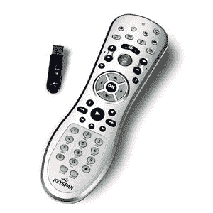

# Keyspan 宣布推出用于 Windows Media Center | TechCrunch 的射频遥控器

> 原文：<https://web.archive.org/web/http://techcrunch.com/2007/08/07/keyspan-announces-rf-remote-for-windows-media-center/>

# Keyspan 宣布推出用于 Windows Media Center 的射频遥控器

 Keyspan 宣布用于 Windows Vista 的射频遥控器现已上市。没错，它使用的是无线电频率而不是红外线，因为它不需要站在配对设备的前面就能工作，信号要大得多(最远可达 90 英尺)，而且它可以穿透墙壁，但我跑题了。再讲一点 RF，我们就可以继续了。因为遥控器可以穿透墙壁或家具，所以你可以选择将你的电脑或影音设备藏在不同的房间里(不太聪明，但这是一个选择)，或者你可以将所有东西都放进一个柜子里。可能是窃贼或客人会对你不存在的家庭影院感到惊讶。我为这个话题道歉，但是我觉得有必要。

不管怎样，Keyspan remote 以 49 美元的低价操作你的 Windows Vista 媒体设备。Keyspan 的 RF 遥控器经过 Windows Vista 认证，可与 Windows Vista Home Premium 或 Windows Vista Ultimate 配合使用。

[产品页面](https://web.archive.org/web/20130628202205/http://www.keyspan.com/products/erv2/homepage.spml)