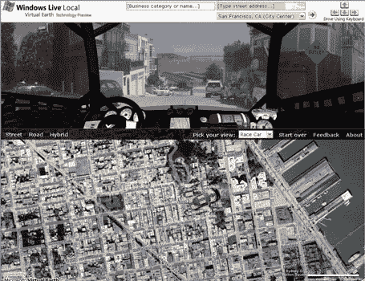

# 新 Live.com 黑仔服务:街边 

> 原文：<https://web.archive.org/web/http://www.techcrunch.com/2006/02/28/killer-new-livecom-service-street-side/>

# 新 Live.com 黑仔服务:街边

微软的 Live.com 今天发布了一项名为 [Street-Side](https://web.archive.org/web/20230217023710/http://preview.local.live.com/) 的新服务的预览版。街景将会增强本地的[直播服务，并提供整个城市的街景。搜索可以按地址或企业名称进行，你可以使用箭头键在城市中“开车”。请看下面的屏幕截图。](https://web.archive.org/web/20230217023710/http://local.live.com/)

请看罗伯特·斯考伯在第九频道的视频，了解他对球队的采访。

这项服务最初将只针对旧金山和西雅图，因为需要大量的图像来支持它的工作(传言每个城市有 1000 多万张图像)。

Live.com 团队向记者发送了一封电子邮件，其中包含以下信息:

> *今天，我们宣布了针对 Windows Live Local 的新街道计划以及新街道功能的技术预览。
> 
> *街边倡议是我们愿景的一个关键部分，旨在提供真实世界的沉浸式数字呈现，使用户能够了解他们的周围环境，找到他们想要的东西，并知道如何到达那里。
> 
> *新的街道功能增强了 Windows Live 本地网站目前已有的地图视图、鸟瞰图和鸟瞰图，为用户提供了一种更加身临其境的方式来探索他们的本地环境。

Live.com 继续[击败 ajax 主页的竞争对手](https://web.archive.org/web/20230217023710/http://www.readwriteweb.com/archives/ajax_homepages.php)(见 Alexa 图表链接)。像 Street-Side 这样的服务会让其他人更难竞争。

屏幕截图:

