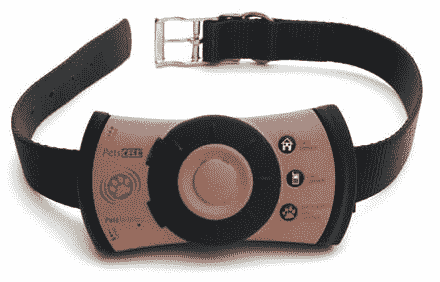

# 给狗一部电话

> 原文：<https://web.archive.org/web/http://techcrunch.com/2007/02/24/knick-knack-paddywhack-give-a-dog-a-phone/>

# 给狗一部电话

如果你的狗对昂贵的毛衣和美味的牛排不够宠爱，这里有另一个听起来很有用的奢侈品。

[On4 通信](https://web.archive.org/web/20130628161840/http://www.on4communications.com/)正计划发布一款狗用手机。PetsCell 是一种带 GPS 的双向防水通信设备。该手机允许主人直接与任何找到他们宠物的人通话，主人可以通过 PC 或手持设备实时跟踪他们宠物的位置。主人还可以设置一个“地理围栏”边界，当宠物走出虚拟边界时，主人会收到电子邮件通知。虽然该公司表示已经准备好进行商业生产，但是还没有关于上市日期和价格的消息。

[pets cell](https://web.archive.org/web/20130628161840/http://www.cellular-news.com/story/22080.php)[Textually](https://web.archive.org/web/20130628161840/http://www.textually.org/textually/archives/2007/02/015029.htm)via[闪亮闪亮](https://web.archive.org/web/20130628161840/http://www.shinyshiny.tv/2007/02/doggie_mobile.html)