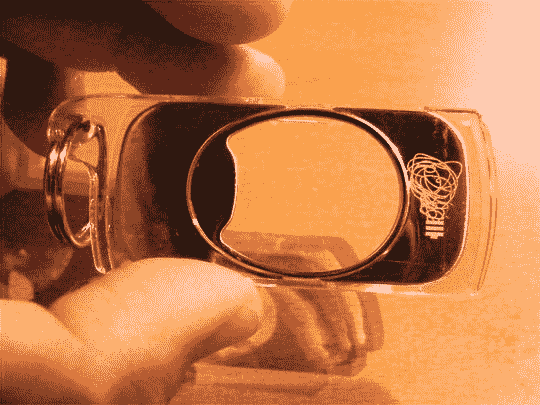
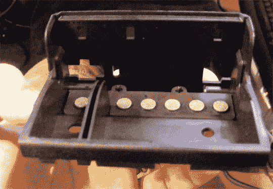
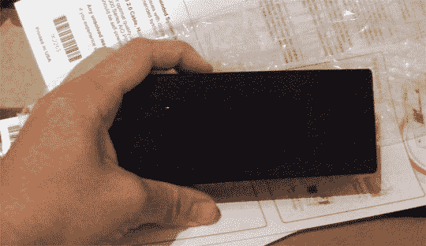
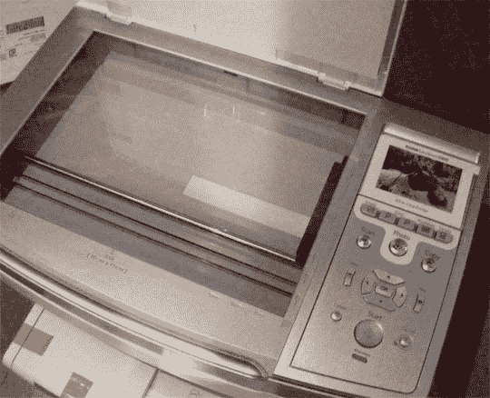
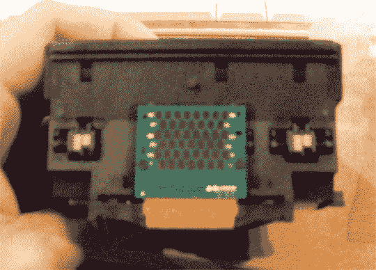
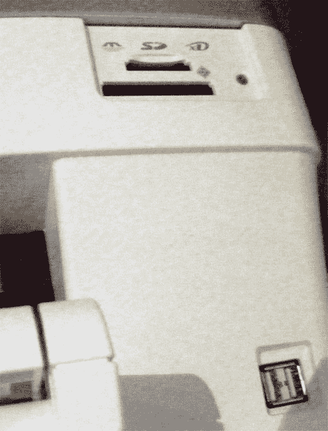
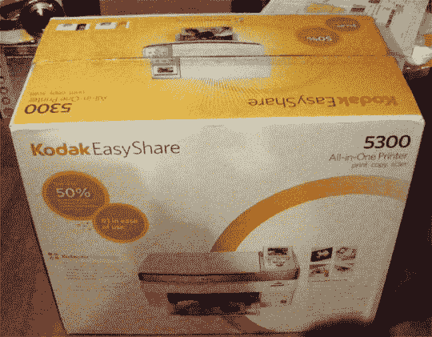

# 柯达 EasyShare 5300 多功能一体打印机评论

> 原文：<https://web.archive.org/web/http://techcrunch.com:80/2007/05/15/kodak-easyshare-5300-all-in-one-printer-review/>

包括我在内的一些人会说打印机的发展已经过时了。喷墨打印机基本上是打印机制造商生产线的终端。通过在一个墨水瓶上粘上一些小孔，然后把这些小孔接上电，你就能以一个相当可接受的价格得到一个对大多数其他高分辨率打印技术的相当不错的仿制品。

所以我们可以使用喷墨打印机。这不是一台很酷的彩色激光打印机，但我们会买一台，打印一些照片。很公平。但是突然之间，2000 年的黑白墨盒开始卖 40 美元，彩色墨盒卖 60 美元。WTF 吧？好吧，柯达拉开了小喷墨进化的帷幕，我很高兴地说，他们做得很好。

介绍柯达 EasyShare 5300。它很大，很笨重，但喂养和维护它并不需要很多钱。这是一台不会让你在复印乐队传单或打印几百张照片时犹豫不决的打印机。这是一个好主意，我很高兴柯达想到了这一点。

这款打印机/复印机/扫描仪售价 199.99 美元，功能齐全。它有一个 SD/MemoryStick/xD 卡插槽和一个 CF 卡插槽，有两个前置 USB 端口，可以直接从记忆卡或兼容 PictBridge 的相机打印。

当我打开盒子安装打印机时，我对它的尺寸感到惊讶。它绝对属于老式传真机的范畴，而不是标准的喷墨打印机，重量为 21 磅。这主要是因为巨大的扫描仪台板和形状奇怪的墨盒实际上相当大。

该打印机使用柯达的 KODAKCOLOR 墨水技术，该技术有几项功能。首先，它提供了更精确的墨点布局，并提高了色牢度和亮度。我不太相信大多数关于彩色打印机的宣传，相反，我的评估是基于照片和普通纸上的实际高分辨率和低分辨率打印。我以草稿、普通和最佳质量打印和复制了一些彩色项目，发现图像几乎完全一样，至少用新墨盒是这样。一个 4×6 高分辨率的手机图像在草稿模式下打印需要 30 秒，在最佳模式下打印需要 29 秒，图像几乎完全相同。也许草稿模式图像稍微亮一点，但是只有用珠宝商的放大镜——是的，我有一个——我才看到饱和度有什么大的不同。

照片冲印得怎么样？这台打印机，比我见过的任何一台都要好，是真正的垃圾进垃圾出。如果来源是粒状的，柯达自己的技术不会改善它。如果图像被洗出来，印刷版本会更洗出来。但是如果你用一个好的相机拍摄一张漂亮的高分辨率的图像，你会得到一张很棒的照片。我注意到的一件事是边缘有点模糊，比 HP 7760 更模糊，但两台打印机产生的结果相似。

现在柯达 9.99 美元的黑色墨盒和 14.99 美元的 5 墨彩色墨盒是怎么卖的？它们将打印头完全卸载到单独的托架上。它是这样工作的。你有主车厢，前后摆动的小部分。然后你有一个打印头，你可以把墨水容器放进去。容器有一个柔软的海绵状物质，在打印头完成大部分工作的同时分配墨水。大多数墨盒都已经安装了打印头，这使得它们无法重新填充，更像是一种 DRM 形式，而不是一种实用的墨水解决方案。副本非常明亮清晰，在普通纸上打印的全尺寸照片有些模糊，但是可以接受。正如所料，相纸让所有的照片都闪闪发光。彩色信纸大小的图像打印时间约为 1:30，而黑白文档打印时间约为 40 秒。

5300 也有一个大的 3 英寸液晶显示屏，一个相当容易导航的用户界面。记忆键支持非常有用，MAC 和 PC 都有驱动程序。如果你已经使用了照片管理器，请随意扔掉 PC 软件，在 MAC 上，该驱动程序与 iPhoto 集成在一起，几乎不可见。不到 200 美元，这是一台完美的家用打印机。与我经常使用的其他打印机相比，5300 打印机在许多情况下都非常适用，从打印学期论文到为奶奶制作相册。虽然用昂贵的墨水和纸张在照片打印机上打印感觉是一种浪费。

我有一个不满:打印机没有 USB 线。没什么大不了的。我最开心的事情是什么？4×6 照片纸盒只需滑入，准备就绪后，LED 灯就会亮起。这是我用过的最简单的开关系统。

柯达深知变革的痛苦。他们是一个世界品牌，现在正在衰落，现在只有他们的打印机和数码相机可以拯救他们。5300 会帮助他们重回光明吗？我认为这个概念和价格是相当合理的，鉴于他们的品牌知名度，新的打印机系列为家庭和家庭办公室用户提供了一个令人信服的替代品。