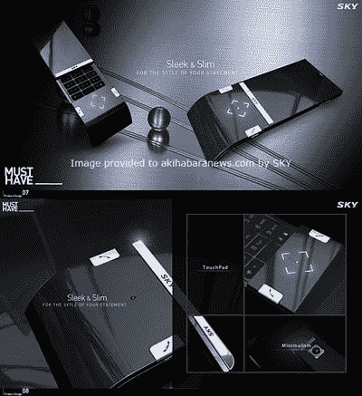

# 韩国天空概念手机:为什么真正的手机如此丑陋？TechCrunch

> 原文：<https://web.archive.org/web/http://techcrunch.com:80/2007/04/03/korea-sky-concept-cellphone-why-are-real-cellphones-so-ugly/>

# 韩国天空概念手机:为什么真正的手机如此丑陋？

关于概念手机的事情是，它们往往比实际的手机看起来好得多，这几乎令人沮丧。这个来自韩国天空的概念只是一个最新的例子，它让许多令人厌倦的实际设计相形见绌。(尽管 Helio 的[海洋](https://web.archive.org/web/20130628171038/http://crunchgear.com/2007/03/26/helio-ocean-dont-call-it-a-messaging-phone-with-keyboard-and-keypad/)——这实际上看起来很有希望。)它的规格无处可寻，但概念很像女性:只要他们是热门，你真的关心他们运行的是什么样的操作系统吗？你当然不知道。

这件事会曝光的几率有多大？我会说介于零和零之间。

天空公司的一款新概念手机【Akihabaranews.com 